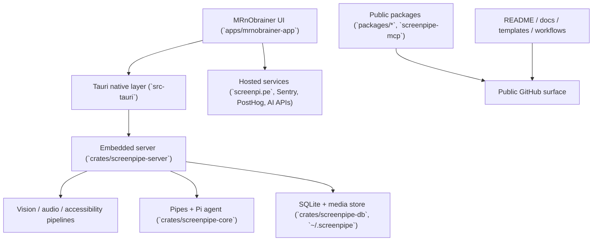

# PLAN: Pre-Open-Source Audit and Shipping Readiness

Audit date: 2026-03-10

Method:
- Direct code inspection across `apps/`, `crates/`, `packages/`, `docs/`, `.github/`, and public manifests.
- Focused brand/redirect leak audit of `apps/mrnobrainer-app`.
- Public-surface benchmark review of OpenClaw's GitHub/docs/website packaging.

Legend:
- `Observed`: verified directly in this repository.
- `Inferred`: likely risk that still needs implementation-time measurement.

## 1. Executive Summary

- Release-readiness score: `4/10`
- Current recommendation: `No-go`

Top blockers:
- Client-facing app flows still route users through Screenpipe-branded deep links, hosts, and copy in login, invite, billing, cloud sync, onboarding log upload, and chat/timeline navigation. This directly conflicts with the desired MRnObrainer in-app experience.
- License and provenance surfaces are inconsistent: root license is MIT-with-`ee/` carve-out, workspace crates advertise `MIT OR Apache-2.0`, app metadata is blank, and `ee/` remains under the Screenpipe Enterprise License.
- The desktop app ships with a broad release permission surface: wildcard outbound HTTP(S), broad filesystem scopes, shell execution, `assetProtocol` scope `["**"]`, and `csp: null`.
- Privacy/trust posture is not ready for public scrutiny: telemetry is default-on, hardcoded Sentry/PostHog keys are embedded, attribution is fetched by IP matching, and the analytics interval appears misconfigured.

Top quick wins:
- Add `SECURITY.md`, `CODE_OF_CONDUCT.md`, and rewrite `CONTRIBUTING.md`, issue templates, and PR template.
- Fix local secret-scan scope so it matches CI.
- Define one canonical public brand map for scheme, domain, invite links, bundle IDs, release URLs, and visible assets.
- Hide or scrub localized Screenpipe READMEs and temp docs migration trees.
- Add a hero screenshot/GIF, architecture diagram, and trust-link cluster to the root README.

Biggest repo risks:
- The repo currently feels like an in-progress fork instead of an intentionally branded product.
- Broad desktop permissions amplify the impact of any future frontend injection or hosted-flow mistake.
- Mixed licensing and the public `ee/` tree create immediate legal/provenance questions.
- Resource-usage criticism is likely if RAM, CPU, and disk behavior are not benchmarked and documented before launch.

## 2. Repo Map

Concise architecture and public-surface map:
- Desktop product: `apps/mrnobrainer-app`
  - Next.js/Tauri shell for onboarding, overlay, settings, timeline, chat, billing, account, sync, and release bundle.
  - Native lifecycle lives in `apps/mrnobrainer-app/src-tauri/src/main.rs`.
- Runtime core: `crates/screenpipe-server`, `crates/screenpipe-core`, `crates/screenpipe-db`, `crates/screenpipe-audio`, `crates/screenpipe-vision`, `crates/screenpipe-accessibility`
  - Embedded server, capture pipeline, OCR/audio, pipe execution, persistence, and API routes.
- Public packages and adjacent surfaces:
  - `packages/agent`
  - `packages/skills`
  - `packages/sync`
  - `packages/screenpipe-js/*`
  - `crates/screenpipe-integrations/screenpipe-mcp`
- Restricted boundary:
  - `ee/` remains public in-tree but is licensed separately from the repo root.
- Public docs and trust surfaces:
  - `README.md`, `README-ja.md`, `README-zh_CN.md`, `CONTRIBUTING.md`, `TESTING.md`, `.github/*`, `docs/*`

Key entrypoints:
- Desktop UI: `apps/mrnobrainer-app/app/page.tsx`
- Desktop native app: `apps/mrnobrainer-app/src-tauri/src/main.rs`
- Desktop native commands: `apps/mrnobrainer-app/src-tauri/src/commands.rs`
- Embedded server binary: `crates/screenpipe-server/src/bin/screenpipe-server.rs`
- Pipe runtime: `crates/screenpipe-core/src/pipes/mod.rs`
- Pi agent execution: `crates/screenpipe-core/src/agents/pi.rs`
- Database layer: `crates/screenpipe-db/src/db.rs`

Long-running services and processes:
- Embedded Screenpipe server started from the desktop app.
- Paired capture + OCR pipeline.
- Hot frame cache and frame disk cache manager.
- Pipe scheduler and pipe execution registry.
- Pi subprocess execution for automation/agent work.
- PostHog/Sentry analytics and periodic resource/telemetry reporting.
- Optional remote sync/OpenClaw sync loops in the desktop settings surface.

Storage and memory-sensitive paths:
- Local app/runtime state: `~/.screenpipe/store.bin`
- Capture data: `~/.screenpipe/data`
- SQLite and related state under `~/.screenpipe`
- Frame disk cache: `cache_dir()/screenpipe/frames` with 10 GB default cap
- Public repo artifacts: large benchmark fixture, MCP binary artifact, generated schema JSON, temp docs images

User-facing surfaces:
- Onboarding, login, settings, account, billing, sync, archive, timeline, chat, tray assets, bundle metadata
- Root README, localized READMEs, app README, package READMEs, issue templates, release workflows

External-facing docs/config surfaces:
- `.github/workflows/*`
- `.github/scripts/validate_open_source_surface.py`
- `.pre-commit-config.yaml`
- `docs/OSS_RELEASE_CHECKLIST.md`
- `apps/mrnobrainer-app/src-tauri/tauri*.conf.json`
- `apps/mrnobrainer-app/src-tauri/capabilities/main.json`

## 3. Findings by Category

### Security

Finding 1
- Severity: `High`
- Affected area/path: `apps/mrnobrainer-app/src-tauri/capabilities/main.json:8-17`, `:31-38`, `:76-186`, `:338-410`; `apps/mrnobrainer-app/src-tauri/tauri.prod.conf.json:56-126`
- Issue: `Observed`. The desktop app allows wildcard outbound HTTP(S), broad shell execution (`sh -c`, `open`, `cmd`), wide filesystem access including `$HOME/*`, `.cursor`, and Claude directories, plus `assetProtocol` scope `["**"]` and `csp: null`.
- Why it matters: if any future frontend injection, markdown/rendering bug, or compromised hosted flow reaches the Tauri layer, the blast radius is much larger than necessary.
- Recommended action: define a minimal release capability set; separate dev-only and release-only permissions; remove wildcard network/file scopes where possible; set a non-null CSP; document the remaining exceptions explicitly.
- Implementation risk: `Medium to high`
- Must happen before open-source release: `Yes`

Finding 2
- Severity: `High`
- Affected area/path: `apps/mrnobrainer-app/lib/hooks/use-settings.tsx:247-250`; `apps/mrnobrainer-app/src-tauri/src/main.rs:1017-1035`, `:1668-1707`; `apps/mrnobrainer-app/src-tauri/src/analytics.rs:49-123`; `apps/mrnobrainer-app/app/page.tsx:264-311`; `apps/mrnobrainer-app/components/onboarding/engine-startup.tsx:191-233`; `apps/mrnobrainer-app/components/onboarding/status.tsx:153-204`
- Issue: `Observed`. Telemetry is default-on, hardcoded Sentry/PostHog credentials are embedded, attribution is fetched by IP matching from `screenpi.pe`, and user-triggered log upload still goes through Screenpipe-hosted endpoints.
- Why it matters: this conflicts with the repo's local-first positioning and will be treated as a trust issue by public users reviewing the code.
- Recommended action: make an explicit public telemetry policy; centralize all telemetry/log-upload endpoints; decide whether attribution belongs in the OSS build; expose clear consent language; add build-time controls for public versus internal distributions.
- Implementation risk: `Medium`
- Must happen before open-source release: `Yes`

Finding 3
- Severity: `High`
- Affected area/path: `apps/mrnobrainer-app/src-tauri/src/analytics.rs:53-64`
- Issue: `Observed`. The analytics manager receives `interval_hours`, but computes `Duration::from_secs(interval_hours * 36)`, not `interval_hours * 3600`.
- Why it matters: this appears to turn an intended 6-hour reporting interval into 216 seconds, increasing network traffic and undermining any public telemetry explanation.
- Recommended action: treat this as a correctness and privacy bug; fix the interval math; add a regression test; re-validate what the app actually sends and how often.
- Implementation risk: `Low`
- Must happen before open-source release: `Yes`

Finding 4
- Severity: `High`
- Affected area/path: `.pre-commit-config.yaml:8-15`; `.github/workflows/secret-scan.yml:31-40`; `.github/scripts/validate_open_source_surface.py:11-18`
- Issue: `Observed`. Local `detect-secrets` still scans the old `apps/screenpipe-app-tauri/...` fixture path, while CI and the validator script scan `apps/mrnobrainer-app/...`.
- Why it matters: maintainers can pass local hooks while missing the most important public fixture in the current repo.
- Recommended action: align local hooks, CI, and the validator script to the same OSS surface.
- Implementation risk: `Low`
- Must happen before open-source release: `Yes`

Finding 5
- Severity: `Medium`
- Affected area/path: `packages/cli/screenpipe/package.json:9`; `packages/cli/screenpipe/scripts/postinstall.sh:1-103`
- Issue: `Observed`. The deprecated CLI package still runs a postinstall script that downloads FFmpeg, attempts package-manager installs with `sudo`, removes quarantine, and sends a PostHog install event.
- Why it matters: if these packages remain publicly discoverable, this will trigger supply-chain and install-behavior scrutiny immediately.
- Recommended action: either remove/hide deprecated CLI packages from the public launch surface or make install behavior explicit, documented, and opt-in.
- Implementation risk: `Medium`
- Must happen before open-source release: `Yes` if the CLI packages remain public

### Stability / Correctness

Finding 1
- Severity: `High`
- Affected area/path: `crates/screenpipe-core/src/agents/pi.rs:517-535`
- Issue: `Observed`. The non-streaming Pi execution path waits on `child.wait_with_output().await?` with no timeout.
- Why it matters: a stuck child process can wedge scheduled automations, degrade shutdown, and create hard-to-debug "app frozen" reports.
- Recommended action: add an execution timeout, timeout metrics, and process-tree cleanup on expiry.
- Implementation risk: `Medium`
- Must happen before open-source release: `Yes`

Finding 2
- Severity: `High`
- Affected area/path: `crates/screenpipe-audio/src/utils/ffmpeg.rs:61-87`
- Issue: `Observed`. FFmpeg helper code uses `spawn().expect(...)`, `stdin.take().expect(...)`, and `wait_with_output().unwrap()`.
- Why it matters: FFmpeg spawn failures or hangs can panic or stall the caller instead of degrading cleanly.
- Recommended action: convert these to structured errors; add timeout/kill handling; ensure failure paths are recoverable.
- Implementation risk: `Low to medium`
- Must happen before open-source release: `Yes`

Finding 3
- Severity: `High`
- Affected area/path: `apps/mrnobrainer-app/src-tauri/src/commands.rs:377-470`; `apps/mrnobrainer-app/components/settings/account-section.tsx:91-141`; `apps/mrnobrainer-app/components/settings/billing-section.tsx:15-99`; `apps/mrnobrainer-app/components/settings/sync-settings.tsx:883-982`; `apps/mrnobrainer-app/components/settings/archive-settings.tsx:175-214`; `apps/mrnobrainer-app/lib/hooks/use-settings.tsx:726-739`
- Issue: `Observed`. Login, account verification, billing, subscription polling, archive checkout, and sync onboarding still depend on Screenpipe-hosted endpoints and browser/deep-link handoff.
- Why it matters: the current app experience can leave MRnObrainer in the middle of a local workflow and bounce the user through Screenpipe-branded hosted flows. This is the exact mid-experience redirect problem called out for this audit.
- Recommended action: centralize hosted dependencies behind a single service boundary; make hosted account actions explicit; ensure the local app never passively redirects the user out of the MRnObrainer experience; add offline/unavailable states.
- Implementation risk: `Medium`
- Must happen before open-source release: `Yes`

### RAM Efficiency

Finding 1
- Severity: `Medium`
- Affected area/path: `crates/screenpipe-core/src/pipes/mod.rs:505-548`
- Issue: `Observed`. `PipeManager` keeps configs, prompt bodies, raw content, logs, running state, and execution IDs in several `Arc<Mutex<HashMap<...>>>` collections.
- Why it matters: memory cost grows with pipe count and run history, and there is no public benchmark showing safe steady-state behavior.
- Recommended action: instrument per-pipe memory cost; bound or externalize state that can grow with usage; add a soak benchmark for many pipes and long-lived sessions.
- Implementation risk: `Medium`
- Must happen before open-source release: `Measure first`

Finding 2
- Severity: `Medium`
- Affected area/path: `crates/screenpipe-server/src/video_cache.rs:84-97`; `:452-460`; `:501-555`
- Issue: `Observed`. Frame cache messages carry full `Vec<u8>` frame blobs through a channel of size 100, and frame extraction paths clone chunk/device metadata while building time-series responses.
- Why it matters: burst capture or timeline requests can create high transient memory pressure through queued image buffers and repeated copies.
- Recommended action: measure peak RSS during burst frame extraction; consider tighter channel bounds, streaming, or backpressure before increasing concurrency.
- Implementation risk: `Medium`
- Must happen before open-source release: `Measure first`

Finding 3
- Severity: `Medium`
- Affected area/path: `crates/screenpipe-server/src/hot_frame_cache.rs:18-20`; `:52-120`
- Issue: `Observed/Inferred`. The hot frame cache keeps today's frames and audio in memory and assumes the footprint is small, but that estimate is not validated against multi-monitor or high-event workloads.
- Why it matters: "local-first desktop capture" tools are judged harshly on peak memory use and long-session behavior.
- Recommended action: benchmark 1-monitor and 2-monitor workdays; record frame/audio counts, peak RSS, and rollover behavior; publish the results.
- Implementation risk: `Low`
- Must happen before open-source release: `Benchmark first`

### Storage / Disk Efficiency

Finding 1
- Severity: `High`
- Affected area/path: `~/.screenpipe`; `apps/mrnobrainer-app/src-tauri/src/main.rs:1606-1623`; `crates/screenpipe-server/src/video_cache.rs:128-142`, `:452-460`
- Issue: `Observed/Inferred`. The public operator story for capture storage, cache growth, retention, and expected footprint is still too weak for a 24/7 capture product.
- Why it matters: users need predictable disk-growth expectations before trusting a background capture tool.
- Recommended action: publish default retention/cleanup behavior; document log rotation and frame-cache defaults; add a disk-growth benchmark for a realistic 8-hour day.
- Implementation risk: `Low`
- Must happen before open-source release: `Yes`

Finding 2
- Severity: `Medium`
- Affected area/path: `crates/screenpipe-server/src/video_cache.rs:128-142`
- Issue: `Observed`. The frame disk cache defaults to 10 GB with 7-day retention, but this is not surfaced clearly in public docs or settings guidance.
- Why it matters: hidden cache growth is exactly the kind of operational surprise that damages trust.
- Recommended action: expose the cache policy in docs and settings copy; decide whether the default should stay at 10 GB for public builds.
- Implementation risk: `Low`
- Must happen before open-source release: `Yes, at least in docs`

Finding 3
- Severity: `Medium`
- Affected area/path: `crates/screenpipe-integrations/screenpipe-mcp/screenpipe-mcp.mcpb`; `apps/mrnobrainer-app/components/__tests__/url-detection-benchmark-data.json`; `docs/mintlify/docs-mintlify-mig-tmp/public/*`
- Issue: `Observed`. The repo tracks large binary/artifact-style files, a 4.8 MB benchmark fixture, and temp docs assets that increase clone size and scrub burden.
- Why it matters: public repo weight and review noise matter more once the project becomes a public product surface.
- Recommended action: decide which artifacts belong in Git, which belong in release assets, and which should be generated or reduced.
- Implementation risk: `Low`
- Must happen before open-source release: `Should fix`

### Runtime / CPU Efficiency

Finding 1
- Severity: `High`
- Affected area/path: `crates/screenpipe-core/src/pipes/mod.rs:516-548`
- Issue: `Observed`. Pipe execution is globally serialized by `Semaphore::new(1)`.
- Why it matters: one slow or stuck automation blocks the entire lane, which becomes user-visible quickly once the repo is public and people stack automations.
- Recommended action: keep the conservative default if needed, but instrument queue wait time and publish a clear policy for single-lane versus bounded parallel execution.
- Implementation risk: `Medium`
- Must happen before open-source release: `Yes, instrument and document`

Finding 2
- Severity: `Medium`
- Affected area/path: `crates/screenpipe-server/src/paired_capture.rs:26-30`
- Issue: `Observed`. OCR work is globally serialized with `Semaphore::new(1)`.
- Why it matters: this protects the CPU, but may become a visible backlog on multi-monitor or bursty event-driven capture workloads.
- Recommended action: benchmark capture-to-index latency and backlog depth before changing concurrency.
- Implementation risk: `Low`
- Must happen before open-source release: `Measure first`

Finding 3
- Severity: `Medium`
- Affected area/path: `apps/mrnobrainer-app/components/settings/account-section.tsx:116-150`; `apps/mrnobrainer-app/components/settings/sync-settings.tsx:904-982`; `apps/mrnobrainer-app/components/settings/billing-section.tsx:103-111`
- Issue: `Observed`. Hosted subscription and billing flows rely on polling loops and periodic refreshes that add background work and more opportunities for UI churn.
- Why it matters: these are not core local-runtime bottlenecks, but they create needless wakeups and support complexity in the exact account flows users already perceive as brittle.
- Recommended action: centralize hosted polling; use bounded backoff with cancellation; avoid polling when the feature is inactive or the app is offline.
- Implementation risk: `Low to medium`
- Must happen before open-source release: `Should fix`

### Branding / Naming

Finding 1
- Severity: `High`
- Affected area/path: `apps/mrnobrainer-app/src-tauri/src/commands.rs:377-470`; `apps/mrnobrainer-app/src-tauri/tauri.prod.conf.json:56-126`; `apps/mrnobrainer-app/src-tauri/src/main.rs:997-1008`, `:1372-1380`; `apps/mrnobrainer-app/lib/hooks/use-team.ts:150-169`; `apps/mrnobrainer-app/components/rewind/chat-message.tsx:172-209`
- Issue: `Observed`. Login, startup handoff, invite links, deep-link parsing, and in-app timeline navigation still accept or emit `screenpipe://` and `screenpi.pe` as first-class public surfaces.
- Why it matters: this is the clearest user-visible proof that the rebrand is incomplete, and it creates the exact "redirect to Screenpipe in the middle of the app" problem that should not ship.
- Recommended action: define one canonical MRnObrainer scheme and public host; keep Screenpipe compatibility only on the receiving side if migration support is needed; remove Screenpipe-branded outbound links from user-visible flows.
- Implementation risk: `Medium`
- Must happen before open-source release: `Yes`

Finding 2
- Severity: `High`
- Affected area/path: `apps/mrnobrainer-app/components/settings/account-section.tsx:99-141`; `apps/mrnobrainer-app/components/settings/billing-section.tsx:15-99`; `apps/mrnobrainer-app/components/settings/sync-settings.tsx:883-982`; `apps/mrnobrainer-app/components/settings/archive-settings.tsx:175-214`; `apps/mrnobrainer-app/lib/hooks/use-settings.tsx:726-739`; `apps/mrnobrainer-app/app/page.tsx:264-311`; `apps/mrnobrainer-app/components/onboarding/engine-startup.tsx:191-233`; `apps/mrnobrainer-app/components/onboarding/status.tsx:153-204`
- Issue: `Observed`. Core in-app surfaces still call Screenpipe-hosted user, billing, cloud-sync, archive, and log-upload endpoints, and some copy still says `screenpipe pro`.
- Why it matters: even when technically intentional, it reads as a brand leak unless the hosted dependency is explained as part of an explicit account feature boundary.
- Recommended action: publish a hosted-features policy; isolate Screenpipe-hosted dependencies behind one internal service map; rewrite user-visible copy; ensure local-only workflows never trigger hosted redirects or Screenpipe branding.
- Implementation risk: `Medium`
- Must happen before open-source release: `Yes`

Finding 3
- Severity: `Medium`
- Affected area/path: `README-ja.md`; `README-zh_CN.md`; `apps/mrnobrainer-app/src-tauri/tauri.prod.conf.json:4-18`, `:111-115`; `apps/mrnobrainer-app/public/screenpipe.svg`; `apps/mrnobrainer-app/src-tauri/src/reminders.rs`; `apps/mrnobrainer-app/components/settings/openclaw-card.tsx:45-48`, `:215`
- Issue: `Observed`. Localized READMEs, tray asset names, bundle identifiers, reminders list names, public assets, and client copy still surface Screenpipe.
- Why it matters: these are the repo and app surfaces strangers actually see first.
- Recommended action: scrub or hide public/user-visible remnants now; defer purely internal names until later.
- Implementation risk: `Low to medium`
- Must happen before open-source release: `Yes`

### Open-source Readiness

Finding 1
- Severity: `High`
- Affected area/path: repository root
- Issue: `Observed`. There is no `SECURITY.md` and no `CODE_OF_CONDUCT.md`.
- Why it matters: public repos are expected to explain vulnerability reporting and basic community behavior.
- Recommended action: add both before launch with concise, standard wording.
- Implementation risk: `Low`
- Must happen before open-source release: `Yes`

Finding 2
- Severity: `High`
- Affected area/path: `CONTRIBUTING.md:1-120`; `.github/ISSUE_TEMPLATE/*.md`; `.github/pull_request_template.md`; `.github/config.yml`
- Issue: `Observed`. Contributor-facing surfaces are still Screenpipe-branded and include gatekeeping or off-putting language.
- Why it matters: contributor UX is part of the product once the repo is public.
- Recommended action: rewrite contribution and support surfaces for a conventional OSS workflow, with privacy-conscious repro guidance and no gatekeeping language.
- Implementation risk: `Low`
- Must happen before open-source release: `Yes`

Finding 3
- Severity: `Medium`
- Affected area/path: `apps/mrnobrainer-app/package.json:4-15`, `:121-124`; `apps/mrnobrainer-app/bun.lock`; `apps/mrnobrainer-app/package-lock.json`; root `.gitignore`
- Issue: `Observed`. The main app declares `packageManager: pnpm`, scripts are Bun-based, `bun.lock` and `package-lock.json` are both tracked, and root `.gitignore` ignores `pnpm-lock.yaml`.
- Why it matters: this increases onboarding friction and weakens reproducibility for new contributors.
- Recommended action: standardize on one JS package manager per surface and remove stale lockfile/tooling drift before launch.
- Implementation risk: `Low`
- Must happen before open-source release: `Should fix`

### License / Provenance

Finding 1
- Severity: `High`
- Affected area/path: `LICENSE.md:25-27`; `Cargo.toml:8-13`; `apps/mrnobrainer-app/src-tauri/Cargo.toml:1-8`
- Issue: `Observed`. Root repo license is MIT except `ee/`, workspace crates advertise `MIT OR Apache-2.0`, and the desktop app has blank `license` and `repository` metadata.
- Why it matters: scanners, lawyers, contributors, and package consumers will get contradictory answers about what this project is.
- Recommended action: reconcile the root license story, crate SPDX fields, and app/package metadata before public launch.
- Implementation risk: `Low code`, `Medium coordination`
- Must happen before open-source release: `Yes`

Finding 2
- Severity: `High`
- Affected area/path: `ee/README.md:1-20`; `ee/LICENSE`
- Issue: `Observed`. `ee/` remains public in-tree and is explicitly licensed under the Screenpipe Enterprise License.
- Why it matters: if MRnObrainer is presented as an open-source public repo, `ee/` immediately raises questions about redistribution rights, scope, and what is actually open.
- Recommended action: make an explicit keep/split/remove decision for `ee/` before launch. The conservative default is to keep it out of the first public MRnObrainer release branch.
- Implementation risk: `Medium`
- Must happen before open-source release: `Yes`

### Dependencies / Supply Chain

Finding 1
- Severity: `High`
- Affected area/path: `crates/screenpipe-vision/Cargo.toml:28`, `:80-84`; `crates/screenpipe-audio/Cargo.toml:23`, `:37`, `:84`; `crates/screenpipe-core/Cargo.toml:14`, `:74-76`; `apps/mrnobrainer-app/src-tauri/Cargo.toml:80`, `:145-152`
- Issue: `Observed`. Runtime-critical functionality depends on several git-sourced forks and non-registry dependencies, including Screenpipe-owned forks.
- Why it matters: public consumers will expect a clear maintenance and license story for every fork that sits on the critical path.
- Recommended action: create a provenance inventory for all git dependencies; classify each as must-keep, should-upstream, or replace-later; document why each fork exists.
- Implementation risk: `Low to medium`
- Must happen before open-source release: `Yes`

Finding 2
- Severity: `High`
- Affected area/path: `packages/agent/package.json:1-35`; `packages/skills/package.json:1-36`; `packages/sync/package.json:1-33`; `crates/screenpipe-integrations/screenpipe-mcp/package.json:1-45`; `packages/screenpipe-js/browser-sdk/package.json:1-31`; `packages/screenpipe-js/node-sdk/package.json:1-29`
- Issue: `Observed`. Public manifests still publish under Screenpipe names, Screenpipe repository URLs, or blank metadata, while the repo is marketed as MRnObrainer.
- Why it matters: this creates supply-chain and provenance confusion, especially if npm consumers discover these packages independently of the repo.
- Recommended action: make a package-by-package public naming decision: keep Screenpipe-branded intentionally, rename, or hold back from launch. Then align `name`, `description`, `author`, `license`, `repository`, and README copy.
- Implementation risk: `Medium`
- Must happen before open-source release: `Yes`

Finding 3
- Severity: `Medium`
- Affected area/path: `apps/mrnobrainer-app/package.json:37-38`
- Issue: `Observed`. The MRnObrainer app still depends on `@screenpipe/browser` and `@screenpipe/js`.
- Why it matters: this may be reasonable as a compatibility layer, but if it is not explained it reinforces the "unfinished fork" perception.
- Recommended action: either keep these dependencies and document the lineage clearly, or replace them before launch if the public surface should be MRnObrainer-only.
- Implementation risk: `Medium`
- Must happen before open-source release: `Decision required`

### Tests / CI / Observability

Finding 1
- Severity: `Medium`
- Affected area/path: `.github/workflows/ci.yml:43-70`
- Issue: `Observed`. Rust CI is meaningful, but Bun tests are commented out in the Linux CI flow and the public release gate is still backend-heavy.
- Why it matters: the most user-visible surface is the desktop app, so the public launch bar should not lean mostly on Rust-only coverage.
- Recommended action: add at least one stable desktop-app unit/integration lane to the main CI path.
- Implementation risk: `Low to medium`
- Must happen before open-source release: `Should fix`

Finding 2
- Severity: `Medium`
- Affected area/path: `.github/scripts/validate_open_source_surface.py`; `.github/workflows/secret-scan.yml`
- Issue: `Observed`. The repo already has a useful OSS-surface validator and it currently passes, but its scope is narrow and does not gate branding, Tauri permissions, license metadata, or public package manifests.
- Why it matters: this is a real strength, but not yet a full release gate for public launch.
- Recommended action: keep the validator, then extend it to cover localized READMEs, package metadata, Tauri config, public URLs/emails, and release endpoints.
- Implementation risk: `Low`
- Must happen before open-source release: `Yes`

Finding 3
- Severity: `Medium`
- Affected area/path: `TESTING.md`; `crates/screenpipe-db/benches`; `crates/screenpipe-server/tests/*`; `crates/screenpipe-vision/tests/*`
- Issue: `Observed`. The repo has real tests and benchmarks, but no release-ready benchmark gate for memory, storage growth, capture latency, or pipe soak behavior.
- Why it matters: open-source criticism will land on resource use and long-running stability, not just compile/test correctness.
- Recommended action: add a targeted public-release benchmark set and a documented release checklist that includes resource measurements.
- Implementation risk: `Low`
- Must happen before open-source release: `Yes`

### Docs / Developer Experience

Finding 1
- Severity: `High`
- Affected area/path: `README.md`; `README-ja.md`; `README-zh_CN.md`; `docs/mintlify/docs-mintlify-mig-tmp/*`
- Issue: `Observed`. The English README is materially better than the surrounding docs, but localized READMEs and temp docs trees still tell a different Screenpipe story.
- Why it matters: first impressions collapse if the repo presents two incompatible identities in the first minute.
- Recommended action: either fully migrate or temporarily hide/simplify legacy docs until they match the public MRnObrainer narrative.
- Implementation risk: `Low`
- Must happen before open-source release: `Yes`

Finding 2
- Severity: `Medium`
- Affected area/path: `packages/agent/README.md`; `packages/skills/README.md`; `packages/sync/README.md`; `crates/screenpipe-integrations/screenpipe-mcp/README.md`
- Issue: `Observed`. Public package READMEs still center Screenpipe and often assume old branding or hosted docs.
- Why it matters: npm/MCP users may encounter these surfaces before the repo root.
- Recommended action: either scrub these READMEs for launch or intentionally leave them Screenpipe-branded and move them out of the MRnObrainer public launch story.
- Implementation risk: `Low`
- Must happen before open-source release: `Yes`

Finding 3
- Severity: `Medium`
- Affected area/path: `README.md`; `apps/mrnobrainer-app/README.md`; `docs/OSS_RELEASE_CHECKLIST.md`
- Issue: `Observed`. Good material exists, but the repo still lacks one concise architecture/onboarding/privacy document that explains what is local, what is hosted, where data lives, and what contributors should run first.
- Why it matters: contributors and reviewers should not have to reconstruct the product model from code and scattered docs.
- Recommended action: add one short architecture-and-operations doc linked near the top of the README.
- Implementation risk: `Low`
- Must happen before open-source release: `Should fix`

### Marketing / Public Packaging

Finding 1
- Severity: `Medium`
- Affected area/path: `README.md`
- Issue: `Observed`. The root README explains the direction clearly, but it still lacks a top-of-page hero visual, architecture visual, and trust-link cluster.
- Why it matters: strong OSS repos win or lose attention in the first screenful.
- Recommended action: add one hero screenshot/GIF, one architecture diagram, and one link cluster for `Install`, `Docs`, `Security`, and `Contributing`.
- Implementation risk: `Low`
- Must happen before open-source release: `Should fix`

Finding 2
- Severity: `Medium`
- Affected area/path: `.github/workflows/release-app.yml`; `.github/workflows/release-cli.yml`; `.github/workflows/publish-release.yml`; `apps/mrnobrainer-app/src-tauri/tauri.prod.conf.json`
- Issue: `Observed`. Release workflows and bundle metadata still reference Screenpipe buckets, hosts, identifiers, and release semantics.
- Why it matters: public packaging is part of the product. Inconsistent release surfaces make the repo look smaller and less intentional than it is.
- Recommended action: treat release packaging as a launch workstream, not a cosmetic follow-up.
- Implementation risk: `Medium`
- Must happen before open-source release: `Yes`

Finding 3
- Severity: `Medium`
- Affected area/path: repo-wide public surfaces
- Issue: `Observed/Inferred`. The repo has enough substance to feel credible, but not yet enough presentation discipline to feel movement-like, product-ready, and intentionally maintained.
- Why it matters: contributors, users, investors, and critics will all judge the public repo as a product surface, not just as code.
- Recommended action: apply the lightweight OpenClaw lessons below without overbuilding: one canonical story, one clean onboarding path, one ecosystem view, and visible trust signals.
- Implementation risk: `Low`
- Must happen before open-source release: `Should fix`

### Architecture / Module Quality

Finding 1
- Severity: `Medium`
- Affected area/path: `apps/mrnobrainer-app/src-tauri/src/main.rs` (`2300` lines); `crates/screenpipe-core/src/pipes/mod.rs` (`3175` lines); `crates/screenpipe-db/src/db.rs` (`5921` lines); `apps/mrnobrainer-app/components/standalone-chat.tsx` (`3243` lines); `apps/mrnobrainer-app/components/settings/recording-settings.tsx` (`2456` lines); `apps/mrnobrainer-app/src-tauri/src/window_api.rs` (`1938` lines)
- Issue: `Observed`. Several high-risk areas concentrate too much behavior in a few giant files.
- Why it matters: this raises the cost and risk of every launch-blocking fix: branding scrub, permission hardening, telemetry cleanup, runtime stability work, and docs alignment all become harder to review safely.
- Recommended action: avoid a big-bang refactor before launch, but do targeted splits in the highest-churn launch blockers: deep-link/account flows, telemetry setup, Tauri permissions, and pipe lifecycle boundaries.
- Implementation risk: `High` if broad, `Low to medium` if surgical
- Must happen before open-source release: `Only targeted splits; no broad refactor`

## 4. Priority Buckets

### Must fix before public release

- Define one canonical MRnObrainer public identity for deep links, domains, invites, bundle IDs, release metadata, and visible copy.
- Remove Screenpipe-branded outbound redirects from the client-facing app. If compatibility is required, keep it on the receiving path only.
- Reconcile license/provenance metadata across root license, workspace crates, app metadata, public packages, and package READMEs.
- Make an explicit decision on `ee/` before launch.
- Tighten Tauri release capabilities, asset scope, and CSP for the desktop app.
- Fix the telemetry interval bug and publish a public privacy/hosted-features policy.
- Add `SECURITY.md`, `CODE_OF_CONDUCT.md`, and rewrite contributor/issue/PR surfaces.
- Align local and CI secret-scanning scope.
- Add timeout/error handling for Pi and FFmpeg subprocesses.
- Decide which Screenpipe-branded packages/SDKs/CLI surfaces ship publicly and scrub or hide the rest.
- Publish retention/footprint guidance for capture data and frame cache behavior.

### Should fix soon after release

- Gate at least one desktop-app test lane in main CI.
- Standardize JS package manager and lockfiles.
- Add hero visuals, architecture diagram, and trust-link cluster to the README.
- Reduce or move oversized tracked artifacts where they do not need to live in Git.
- Instrument queue wait time, capture backlog, and frame extraction peak RSS.

### Nice to have

- Upstream or replace git-sourced forks where practical.
- Publish a simple compatibility/support matrix.
- Create a more polished docs IA once legacy docs are scrubbed.
- Add public benchmark dashboards for capture latency, RAM, and storage growth.

### Explicitly safe to defer

- Internal crate/package renames that do not leak into the public surface.
- Migration away from `~/.screenpipe` if it adds risk without public value.
- Broad architectural refactors of giant files beyond the launch-critical slices.
- Internal helper names such as `spawnScreenpipe` or `showScreenpipeShortcut` if they no longer leak into UI/docs/logs.

## 5. OpenClaw Benchmark Investigation

Sources reviewed:
- [OpenClaw repo](https://github.com/openclaw/openclaw)
- [OpenClaw README](https://raw.githubusercontent.com/openclaw/openclaw/main/README.md)
- [OpenClaw docs](https://docs.openclaw.ai/get-started/introduction)
- [OpenClaw website](https://openclaw.ai)
- [OpenClaw trust page](https://trust.openclaw.ai)
- Adjacent repos: [clawhub](https://github.com/openclaw/clawhub), [nix-openclaw](https://github.com/openclaw/nix-openclaw)

Observed strengths:
- OpenClaw states the product category immediately and gives one obvious onboarding path.
- Its top-of-page surfaces cluster docs, install, trust, and ecosystem links early.
- The project feels ecosystem-shaped, not repo-shaped: main repo, docs, website, trust page, and adjacent repos reinforce the same identity.
- Contributor-facing trust signals are visible: public docs, releases, security/community surfaces, and coherent branding across destinations.

What makes it feel large, credible, and movement-like:
- One canonical "start here" path instead of many equal options.
- Product-shaped README packaging rather than code-dump packaging.
- A coherent ecosystem story: core repo, docs, optional adjacent surfaces, and public trust pages all connect cleanly.
- Consistent naming and copy across repo, docs, and public website.

What is transferable to this repo:
- Put one canonical install/onboarding path at the top of the README.
- Cluster `Install`, `Docs`, `Security`, and `Contributing` near the top.
- Show one ecosystem view: desktop app, local runtime, MCP surface, and OpenClaw worker path.
- Keep lineage explicit in one contained block instead of letting old brand remnants leak everywhere.
- Use product language consistently across repo, app, docs, and package surfaces.

What is not transferable:
- OpenClaw's exact tone, visual identity, or implied scale.
- A sprawling multi-repo/public-site surface before MRnObrainer has one coherent story.
- Claims of platform breadth, polish, or hosted maturity that this repo cannot yet defend.

Risks and caveats:
- More public surfaces create more maintenance work.
- Ecosystem packaging only helps if the naming is already coherent.
- A small-team project can feel large in public, but it cannot afford contradictory docs or inconsistent trust signals.

Specific tactics we should adapt:
- Add one README hero visual plus one architecture diagram.
- Add a top cluster for `Releases`, `Docs`, `Security`, and `Contributing`.
- Add one "What is local / What is hosted / What is optional" section.
- Add one intentional `Built on Screenpipe` lineage block and stop leaking Screenpipe branding everywhere else.
- Present the repo as one product stack: desktop capture UI, local runtime, searchable timeline, automation runtime, optional OpenClaw execution path.

Concrete tasks for this repo:
- Rewrite the first screenful of `README.md` around one install path and one visual.
- Add one public trust section: security reporting, compatibility/support policy, release expectations.
- Decide whether localized READMEs are launch-ready; if not, hide them until migrated.
- Align release workflows and package metadata so public surfaces reinforce the same product name.
- Keep the OpenClaw mention as an integration/execution path, not as a replacement identity.

## 6. Branding and Public Surface Scrub Map

### Must scrub now

- Deep-link schemes and redirect hosts:
  - `apps/mrnobrainer-app/src-tauri/src/commands.rs`
  - `apps/mrnobrainer-app/src-tauri/tauri.prod.conf.json`
  - `apps/mrnobrainer-app/src-tauri/src/main.rs`
  - `apps/mrnobrainer-app/lib/hooks/use-team.ts`
  - `apps/mrnobrainer-app/components/rewind/chat-message.tsx`
- Hosted account/billing/sync/archive/user endpoints and copy:
  - `apps/mrnobrainer-app/components/settings/account-section.tsx`
  - `apps/mrnobrainer-app/components/settings/billing-section.tsx`
  - `apps/mrnobrainer-app/components/settings/sync-settings.tsx`
  - `apps/mrnobrainer-app/components/settings/archive-settings.tsx`
  - `apps/mrnobrainer-app/lib/hooks/use-settings.tsx`
- Onboarding and support/log-upload flows that still hit `screenpi.pe`:
  - `apps/mrnobrainer-app/app/page.tsx`
  - `apps/mrnobrainer-app/components/onboarding/engine-startup.tsx`
  - `apps/mrnobrainer-app/components/onboarding/status.tsx`
- Bundle metadata and user-visible assets:
  - `apps/mrnobrainer-app/src-tauri/Cargo.toml`
  - `apps/mrnobrainer-app/src-tauri/tauri.prod.conf.json`
  - `apps/mrnobrainer-app/public/screenpipe.svg`
  - tray asset names and tray IDs in `src-tauri`
- Public docs and templates:
  - `README-ja.md`
  - `README-zh_CN.md`
  - `CONTRIBUTING.md`
  - `.github/ISSUE_TEMPLATE/*`
  - `.github/pull_request_template.md`
- Public package/manifests:
  - `packages/agent/*`
  - `packages/skills/*`
  - `packages/sync/*`
  - `packages/screenpipe-js/*`
  - `crates/screenpipe-integrations/screenpipe-mcp/*`

### Should scrub soon

- Client-facing but lower-severity copy:
  - `apps/mrnobrainer-app/components/settings/openclaw-card.tsx` (`~/screenpipe-data`, "screenpipe data")
  - reminders list naming in `apps/mrnobrainer-app/src-tauri/src/reminders.rs`
  - any remaining `screenpipe pro` copy in settings and paywall flows
- Public examples, fixtures, and screenshots that still narrate the product as Screenpipe:
  - large benchmark fixture and any bundled screenshots
- Internal comments that teach future contributors the old public story:
  - `Screenpipe Brand` comments in UI files
  - Screenpipe-specific deep-link comments in onboarding/auth helpers

### Acceptable to leave for now

- Internal crate names such as `screenpipe-*`
- Sidecar binary names and CLI compatibility names if they do not surface to users
- Local data directory names such as `~/.screenpipe`
- Internal store keys and helpers like `showScreenpipeShortcut`, `spawnScreenpipe`, and `stopScreenpipe` if they stop leaking into UI/docs/logs

## 7. Performance and Resource Plan

Likely RAM hotspots:
- `PipeManager` in-memory config/log/run registries in `crates/screenpipe-core/src/pipes/mod.rs`
- `FrameCache` message queues carrying full `Vec<u8>` image blobs in `crates/screenpipe-server/src/video_cache.rs`
- `HotFrameCache` holding today's frames and audio in memory in `crates/screenpipe-server/src/hot_frame_cache.rs`
- Large long-lived UI state in giant desktop app files like `standalone-chat.tsx` and timeline-related hooks

Likely leak and hang risks:
- Pi subprocesses with no completion timeout
- FFmpeg subprocess wrapper using `expect`/`unwrap`
- Background hosted polling loops in account/sync/billing flows
- Long-lived lifecycle responsibilities concentrated in `apps/mrnobrainer-app/src-tauri/src/main.rs`

Unnecessary allocations and copies to review:
- `wait_with_output()` in Pi/FFmpeg paths collects full stdout/stderr in memory
- Frame extraction/cache code passes full JPEG buffers through channels
- Log upload code concatenates multiple log files plus console output into one large string before upload

Storage growth risks:
- Ongoing capture data under `~/.screenpipe/data`
- Frame disk cache defaulting to 10 GB with 7-day retention
- Public repo weight from tracked binary/artifact-style files and oversized fixtures

Retention and cleanup gaps:
- Pipe execution cleanup exists, but broader capture/cache/user-facing retention policy is under-documented
- Users do not yet get a clear public explanation of what grows, what rotates, and what they should prune

Logging growth:
- App log rotation is already bounded at daily rotation with `max_log_files(5)` in `apps/mrnobrainer-app/src-tauri/src/main.rs:1611-1623`
- Preserve that behavior and document where logs live
- Verify the server/runtime log policy is equally bounded and documented

Benchmark plan:
- Pipe soak test:
  - queue wait time
  - run duration
  - timeout rate
  - stuck-child cleanup behavior
- Capture benchmark:
  - screenshot-to-frame-write latency
  - OCR queue delay
  - backlog behavior with 1 monitor and 2 monitors
- Timeline/resource benchmark:
  - time to first frame
  - peak RSS while scrolling recent history
  - frame extraction rate under cache hits versus misses
- Disk benchmark:
  - 8-hour representative workday
  - data growth per day
  - cache growth with defaults

Profiling plan:
- macOS: Instruments for leaks/time profiler on capture and timeline flows
- Linux: heaptrack or valgrind massif for frame extraction and pipe runs
- Windows: Windows Performance Recorder / WPA for capture and OCR spikes

Instrumentation plan:
- Pipe queue depth and semaphore wait duration
- Pi/FFmpeg timeout and exit-code counters
- Capture backlog and capture-to-index latency
- Hot-frame cache size and warm-start coverage metrics
- Frame-cache queue depth and cache hit/miss metrics

Low-risk optimization candidates:
- Add timeouts before changing subprocess architecture
- Instrument before parallelizing pipe execution
- Bound or stream frame-data transport before increasing cache concurrency
- Publish retention and storage guidance before attempting risky path migrations
- Move oversized public repo artifacts out of Git when they are not essential to the public source tree

## 8. Docs and Marketing Plan

README improvements:
- Add one hero screenshot or short GIF immediately under the value proposition.
- Add one architecture diagram showing:
  - capture
  - local storage
  - search/timeline
  - automation runtime
  - optional OpenClaw/MCP execution path
- Add one top cluster for:
  - `Releases`
  - `Docs`
  - `Security`
  - `Contributing`
- Add one explicit `What is local / What is hosted / What is optional` section.
- Keep one contained `Built on Screenpipe` lineage block.

Installation and onboarding improvements:
- Keep one primary install path: GitHub Releases for non-technical users.
- Make it clear which features work without an account and which rely on hosted services.
- Add permission troubleshooting and restart guidance directly in the README and app README.

Architecture/docs improvements:
- Add one short architecture-and-operations doc covering:
  - repo map
  - data location
  - cache/retention behavior
  - telemetry/privacy model
  - hosted dependency boundaries
- Hide or finish `docs/mintlify/docs-mintlify-mig-tmp` before linking it publicly.

Contributor experience improvements:
- Rewrite `CONTRIBUTING.md` for a normal OSS contribution flow.
- Add `SECURITY.md` and `CODE_OF_CONDUCT.md`.
- Standardize the JS package manager story.
- Keep `docs/OSS_RELEASE_CHECKLIST.md`, but tighten it into a real release gate.

Trust-signal improvements:
- Show releases, docs, security, and contributing near the top of the repo.
- Add a small compatibility/support matrix.
- Add one public note about release cadence and what "supported" means.
- Keep the existing OSS surface validator, but expand it.

Screenshot/demo/video suggestions:
- One dashboard+timeline hero shot
- One onboarding permissions flow GIF
- One 20-30 second demo clip showing local capture -> search -> automation suggestion
- One architecture PNG/SVG that can also be reused in docs/social posts

Tagline and framing suggestions:
- `Local-first passive workflow automation for your desktop.`
- `Searchable desktop context that turns repeated work into automations.`
- `Built on Screenpipe's capture/runtime foundation, focused on action-first recall.`

How to present the repo as a credible, polished open-source product:
- Be explicit about lineage and present it once.
- Make hosted dependencies opt-in and clearly labeled.
- Keep the public story small, coherent, and honest.
- Prefer fewer, cleaner public surfaces over many half-migrated ones.

## 9. Implementation Roadmap

### Phase 1: High-Risk Blockers

Goals:
- Eliminate public identity confusion.
- Resolve legal/provenance blockers.
- Reduce the desktop app's release-time security risk.

Concrete tasks:
- Finalize public brand map for scheme, domain, invite links, bundle IDs, release assets, and package surfaces.
- Remove Screenpipe-branded outbound redirects and hosted flow copy from the client app.
- Reconcile repo/license/package/app metadata and decide the `ee/` launch posture.
- Tighten Tauri permissions, asset scope, and CSP for release builds.
- Fix telemetry interval math and publish the public privacy/hosted-features policy.
- Add `SECURITY.md`, `CODE_OF_CONDUCT.md`, and new contributor/support templates.

Dependencies:
- Maintainer decision on canonical MRnObrainer public domain/scheme
- Maintainer/legal decision on `ee/`
- Product decision on which hosted services remain part of public OSS

Risks:
- Breaking compatibility for existing Screenpipe deep links or hosted account flows
- Delaying launch if `ee/` or package provenance needs legal review

Likely impact:
- Highest

### Phase 2: Stability / Performance / Resource Hardening

Goals:
- Make the runtime defensible under public scrutiny.
- Add measurement before optimization.

Concrete tasks:
- Add timeout and recovery behavior for Pi and FFmpeg subprocesses.
- Instrument pipe queueing, OCR backlog, frame-cache queue depth, and capture latency.
- Publish storage-retention and cache-footprint guidance.
- Benchmark 1-monitor and 2-monitor capture workloads plus pipe soak behavior.
- Review and reduce memory pressure in frame-cache queueing if benchmarks show it is necessary.

Dependencies:
- Phase 1 permission/privacy decisions

Risks:
- Touching long-running code paths close to launch
- Turning inferred hotspots into scope creep without measurement discipline

Likely impact:
- High

### Phase 3: Public Packaging / Docs / Ecosystem Polish

Goals:
- Make the repo feel intentional, coherent, and easy to try.

Concrete tasks:
- Finish README refresh with hero visual, architecture diagram, and trust-link cluster.
- Clean or hide localized READMEs and temp docs trees.
- Scrub public package READMEs/manifests or explicitly keep them out of launch scope.
- Standardize JS package manager and lockfiles.
- Align release workflows and bundle metadata with the public product story.

Dependencies:
- Phase 1 canonical branding decisions

Risks:
- Documentation churn close to launch
- Over-polishing instead of fixing blockers

Likely impact:
- High

### Phase 4: Post-Launch Hardening

Goals:
- Increase confidence without destabilizing the initial public release.

Concrete tasks:
- Expand app/test coverage in CI.
- Add public benchmark dashboards or recurring benchmark reports.
- Upstream or replace git dependencies where justified.
- Do surgical module splits in the highest-churn giant files.
- Revisit deeper internal renames only where they provide clear public value.

Dependencies:
- Public launch complete

Risks:
- Scope creep
- Refactor risk if bundled with functional changes

Likely impact:
- Medium

## 10. Suggested PR Breakdown

- `PR 1: Public Identity and Redirect Scrub`
  - Deep links, invite links, hosted account/billing/sync copy, bundle identifiers, tray assets, visible Screenpipe strings

- `PR 2: Legal and Provenance Pack`
  - License reconciliation, `ee/` decision, package/app metadata cleanup, lineage notice

- `PR 3: Desktop Security Posture`
  - Tauri capabilities, asset scope, CSP, hosted-endpoint policy, build-time release config review

- `PR 4: Telemetry and Privacy Hardening`
  - Interval fix, telemetry docs, attribution decision, log-upload policy, explicit user-facing controls

- `PR 5: Runtime Timeout and Resource Instrumentation`
  - Pi/FFmpeg timeouts, queue metrics, capture backlog metrics, disk/cache visibility

- `PR 6: Docs, Community, and Trust Surfaces`
  - `README.md`, `SECURITY.md`, `CODE_OF_CONDUCT.md`, `CONTRIBUTING.md`, issue/PR templates, docs cleanup

- `PR 7: Package and Release Surface Cleanup`
  - npm/MCP manifests, public package READMEs, lockfile/package-manager standardization, release workflow naming and URLs

- `PR 8: CI and Benchmark Gates`
  - App test lane, expanded OSS-surface validation, benchmark smoke checks, release checklist enforcement

## 11. Final Recommendation

`No-go until blockers are resolved.`

Why:
- The repo already has real substance: meaningful Rust tests, manual testing guidance, a better root README, bounded app log rotation, and a functioning OSS-surface validator. This is not a code dump.
- But the public launch would still expose contradictory identity, unresolved provenance, over-broad desktop permissions, and a privacy/hosted-services story that is not yet coherent enough for open-source scrutiny.
- The fastest path to a credible public launch is not a large refactor. It is a focused pass on identity, legal/provenance, desktop security posture, hosted dependency boundaries, and a few high-leverage runtime hardening fixes.

If Phase 1 and the must-fix items above are completed cleanly, the recommendation can move to `Go with fixes`.
