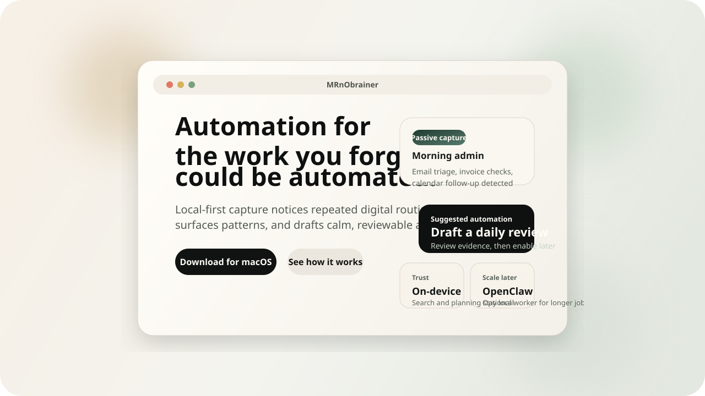
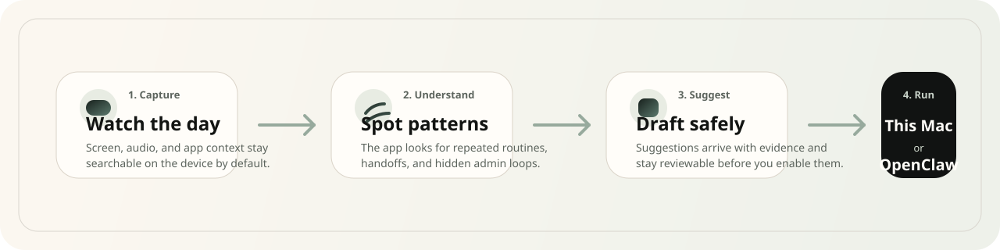

<p align="center">
  
</p>

<p align="center">
  <strong>MRnObrainer</strong><br />
  Automation for the work you forgot could be automated.
</p>

<p align="center">
  MRnObrainer is the local-first desktop app that watches your digital routine,
  keeps it searchable on-device, and suggests automations before you know what
  to ask for.
</p>

<p align="center">
  <a href="https://github.com/CodingLikeCoking/MRnObrainer/releases">
    
  </a>
  <a href="docs/privacy-surface.md">
    
  </a>
  <a href="docs/openclaw-migration.md">
    
  </a>
</p>

<p align="center">
  <a href="https://github.com/CodingLikeCoking/MRnObrainer/releases">Releases</a>
  ·
  <a href="docs/privacy-surface.md">Privacy</a>
  ·
  <a href="docs/performance-envelope.md">Performance</a>
  ·
  <a href="docs/support-matrix.md">Support</a>
  ·
  <a href="SECURITY.md">Security</a>
  ·
  <a href="CONTRIBUTING.md">Contributing</a>
</p>

## What makes it different

Most automation products start with a blank box and ask you to invent a
workflow. MRnObrainer starts with your actual day.

- It quietly captures screen and audio context on your device.
- It turns repeated work into visible patterns instead of hidden friction.
- It drafts reviewable automation suggestions instead of asking you to
  architect everything from scratch.
- It stays local-first, then expands to OpenClaw or other targets only when
  you choose.

MRnObrainer is macOS-first in the current public release phase.

## Why people install it

- inbox triage and end-of-day follow-up
- meeting recall without digging through scattered notes
- repeated back-office tasks that are obvious in hindsight, but hard to design
  upfront
- personal workflows where privacy matters and the user does not want to wire
  together five different tools

## How it works

<p align="center">
  
</p>

MRnObrainer already ships the foundation for:

- local screen and audio capture
- searchable timeline and history
- automation runtime that can execute scheduled workflows
- MCP-facing surfaces for external tools and agents

The product direction on top of that foundation is:

- passive workflow discovery
- calmer onboarding for non-technical users
- local-first planning defaults
- optional OpenClaw routing for longer or remote execution

## First 10 minutes

### For most people

1. Open the [Releases page](https://github.com/CodingLikeCoking/MRnObrainer/releases).
2. Download the latest macOS `.dmg`.
3. Drag `MRnObrainer.app` into `Applications`.
4. Open it once. If macOS blocks first launch, use `right click -> Open` or
   `System Settings -> Privacy & Security -> Open Anyway`.
5. Grant screen recording, microphone, and accessibility permissions.
6. Wait for the automatic relaunch after screen recording is granted.
7. Press `Cmd+Shift+O` to open the combined Ask + Timeline workspace.
8. Confirm you can see recent activity and scroll the timeline.

### For non-technical friend testing

Share this checklist:

1. Download the latest `.dmg` from GitHub Releases.
2. Drag `MRnObrainer.app` into `Applications`.
3. Open it once with `right click -> Open` if macOS blocks the first launch.
4. Accept screen recording, microphone, and accessibility permissions.
5. Wait for the app to relaunch.
6. Press `Cmd+Shift+O`.
7. Confirm the overlay opens and the timeline is scrollable underneath it.

## Privacy and trust

MRnObrainer should feel safe before it feels powerful.

- Search, timeline history, and first-pass planning are intended to stay on the
  device by default.
- Cloud and OAuth paths are optional and should be explicit, not silent.
- Public OSS builds do not send telemetry unless you configure
  `NEXT_PUBLIC_POSTHOG_KEY` (optionally `NEXT_PUBLIC_POSTHOG_HOST`) for the
  frontend, or
  `MRNOBRAINER_POSTHOG_API_KEY`, `MRNOBRAINER_SENTRY_DSN`,
  `SCREENPIPE_POSTHOG_API_KEY`, or `SCREENPIPE_SENTRY_DSN`.
- Secret scanning is enforced in this repo through pre-commit and GitHub
  Actions.

More detail:

- [Privacy surface](docs/privacy-surface.md)
- [Performance envelope](docs/performance-envelope.md)
- [Tauri capability audit](docs/tauri-capability-audit.md)
- [Support matrix](docs/support-matrix.md)
- [Open-source release checklist](docs/OSS_RELEASE_CHECKLIST.md)

## Where OpenClaw fits

MRnObrainer should deliver value on one Mac first. OpenClaw is the optional
second step.

- MRnObrainer: local memory, searchable timeline, suggestions, and execution on
  the primary machine
- OpenClaw: optional worker for longer-running or remote automations

If you already have an OpenClaw host, use the
[migration guide](docs/openclaw-migration.md) instead of wiring raw config
files by hand.

## Build from source

Prerequisites:

- Rust stable toolchain
- Bun 1.2+
- Tauri system dependencies for your platform

```bash
cd apps/mrnobrainer-app
bun install
bun dev
```

Useful local checks:

```bash
python3 -m pip install pre-commit detect-secrets
pre-commit install
pre-commit run --all-files
```

## Hardware guidance

| Tier | Recommended hardware | Good for |
| --- | --- | --- |
| Lite | Apple Silicon + 16 GB RAM + 512 GB SSD | timeline, search, light local automation |
| Recommended personal | Apple Silicon + 24 GB RAM + 512 GB to 1 TB SSD | daily automation, local models, heavier capture workloads |
| Claw host | Mac mini M4 class with 24 GB RAM minimum | remote OpenClaw workers, multi-task automation, stronger local models |

## Repository guide

- [docs/brand-positioning.md](docs/brand-positioning.md): public messaging and
  tone rules
- [docs/architecture.md](docs/architecture.md): product architecture and system
  relationships
- [apps/mrnobrainer-app/README.md](apps/mrnobrainer-app/README.md): desktop app
  specifics
- [TESTING.md](TESTING.md): manual and automated validation guidance
- [CONTRIBUTING.md](CONTRIBUTING.md): contribution workflow

## Built on Screenpipe

MRnObrainer is built on the Screenpipe capture and runtime foundation. That
lineage is a strength, not something to hide.

Internal package names and some source paths still use `screenpipe` for runtime
compatibility, but the user-facing product language and release surface should
stay MRnObrainer-first.

## Open-source posture

MRnObrainer should be open-source, local-first, and inspectable by default. The
long-term commercial surface should come from managed orchestration, verified
connectors, and team governance, not from hiding the local runtime.

## Contributing

If you maintain an API, SaaS product, device integration, or internal platform,
open a PR for an MCP connector or adapter.

If you want to contribute more broadly, start with
[CONTRIBUTING.md](CONTRIBUTING.md), then review
[docs/CHANGE_RULES.md](docs/CHANGE_RULES.md) and
[docs/OSS_RELEASE_CHECKLIST.md](docs/OSS_RELEASE_CHECKLIST.md) before preparing
public docs, screenshots, fixtures, or release artifacts.
