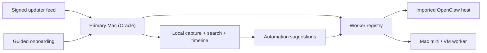

# MRnObrainer Architecture

MRnObrainer is macOS-first in this release phase. The main machine is the `Oracle`: it captures local context, keeps the searchable timeline, and remains the source of truth. Additional machines are `Workers`: they receive context and run longer automations away from the Oracle.

## Core surfaces

- `Oracle`: local capture, search, timeline, shortcuts, and first-pass planning.
- `Workers`: remote Macs, VMs, or imported OpenClaw hosts that execute longer-running automation work.
- `Signed updater feed`: official stable and beta builds update in place through static signed metadata.
- `Guided onboarding`: skippable, replayable setup that explains privacy, permissions, verification, and optional worker pairing.

## Operating rules

- In-place updates are for official signed builds only.
- Source and dev builds continue to use manual updates via GitHub Releases.
- Worker import is guided and explicit. MRnObrainer validates and generates commands, but does not auto-provision remote hosts in v1.
