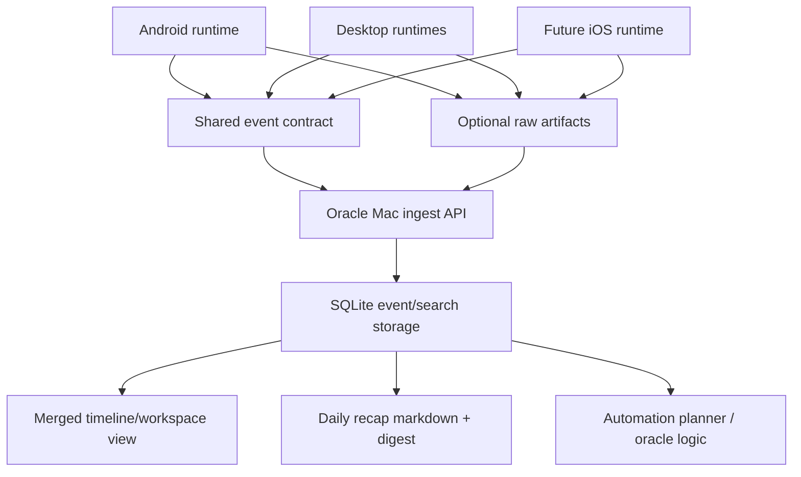

# Android Oracle Cross-Device Design

## Summary

This design adds a separate Android shipping track without forking the product model away from MRnObrainer's existing desktop timeline, search, sync, and recap pipeline.

The first canonical architecture is:

- one Oracle Mac as the primary memory hub
- many desktop or mobile satellites that emit normalized activity events
- optional raw artifacts only where the platform can support them safely
- one merged live timeline plus recap pipeline built from the same cross-device event stream

This is the best fit for the stated use case because the user workflow is often split across devices. Example: reading Gmail on a phone, then drafting the reply on a Mac. A shared event language captures the handoff directly, while raw screen capture alone cannot reliably reconstruct the intent chain across platforms.

## Why This Is The Right First Architecture

### Best application for the use case

Yes, this is the right application if the system is built around a shared event language instead of full raw capture on every device.

The product need is not "mirror every device continuously." The product need is:

- understand what the user is doing across phone and computers
- preserve enough context to let the Oracle Mac reason over it
- show that context in a timeline or workspace-style surface
- create automation opportunities from combined behavior

That is an event-memory problem first, not a full-fidelity capture problem first.

### Computational cost

The expensive part is not the merged timeline. The expensive part is all-day raw capture on mobile:

- continuous screenshots plus OCR
- long-running audio capture and transcription
- large media upload and retention
- battery drain and foreground-service pressure

The cheap part is structured event memory:

- app foreground changes
- share intents
- notification summaries
- clipboard changes
- explicit user notes
- task handoff markers

Therefore the architecture should be:

1. event-language first
2. optional raw capture second
3. recap generation and live timeline both built from the same normalized stream

If later optimization is needed, the main levers are obvious:

- reduce Android raw capture frequency
- only allow raw capture during explicit sessions
- summarize on-device before sync
- keep screenshots local unless pinned

## Current Repo Fit

The repo already has the right primitives for this direction:

- desktop timeline/search UI in `apps/mrnobrainer-app`
- server-side sync lifecycle in `crates/screenpipe-server/src/sync_api.rs`
- per-device identity already present in frame/audio storage
- `ui_events` and `accessibility` tables with sync-oriented columns in `crates/screenpipe-db`
- daily recap artifacts in `pipes/rewind-daily-review`
- a summary sync package in `packages/sync`

The main missing pieces are:

- a normalized cross-device ingest API
- a stable event contract for mobile and future iOS
- a merged timeline view that treats desktop and mobile events as peers
- an Android app/runtime that can emit the contract

## Architecture

## Product Model

### Oracle Mac

The Oracle Mac is the primary source of truth in v1:

- stores the merged event memory
- performs recap generation
- performs automation planning
- exposes the API used by satellites
- renders the unified timeline/workspace view

This fits the current local-first posture and avoids introducing hosted infra before the data model is stable.

### Satellites

Satellites include Android and other Macs. They send:

- normalized event batches
- optional summaries
- optional raw artifacts only when allowed and useful

They do not need to be fully symmetric with the Oracle Mac in v1.

## Shared Event Language

The stable cross-platform contract should represent intent and context, not platform implementation details.

Core event families:

- `app_focus_changed`
- `window_focus_changed`
- `clipboard_changed`
- `text_shared`
- `notification_received`
- `deep_link_opened`
- `voice_note_captured`
- `task_handoff_started`
- `task_handoff_completed`
- `user_note_created`
- `accessibility_snapshot`
- `raw_capture_session_started`
- `raw_capture_session_stopped`

Each event should carry:

- `event_id`
- `source_device_id`
- `source_device_name`
- `source_platform`
- `session_id`
- `occurred_at`
- `kind`
- `app_name`
- `window_title`
- `url`
- `text_payload`
- `metadata`

The current repo can map much of this to existing `ui_events` and `accessibility` storage for the first implementation slice, instead of forcing a new storage engine immediately.

## Raw Capture Policy

Raw capture is optional and policy-gated.

### macOS helpers

Mac helpers can continue using the existing capture stack.

### Android

Android can support:

- app usage and foreground events
- notification listeners
- share targets
- explicit text or voice notes
- user-consented screen capture sessions through MediaProjection

Android should not try to run unrestricted always-on full-fidelity capture in v1.

### iOS later

iOS should be planned around the shared event contract first because its background capture model is much more constrained than Android and macOS.

## Timeline And Recap

The merged timeline and daily recap should come from the same event store.

### Live timeline

Purpose:

- let the main working device see what helper Macs and Android are doing now or recently
- expose cross-device handoffs in chronological order
- preserve per-device identity in the current workspace-style UI

### Daily recap

Purpose:

- produce a stable markdown artifact even when live connectivity is intermittent
- keep a cheap, durable summary layer for later automation
- provide the fallback mode if raw capture is reduced for battery/privacy reasons

The existing `rewind-daily-review` pipe should be extended to consume normalized cross-device events, not just desktop search output.

## Delivery Shape

This work should live in a separate branch and worktree inside the same monorepo, not a separate repository.

Reason:

- it reuses existing server, DB, timeline, and recap surfaces heavily
- a split repo would duplicate protocol and UI logic too early
- the current dirty working branch can stay untouched by using a clean linked worktree

Current isolated worktree:

- branch: `codex/android-oracle-v1`
- worktree: `/Users/owenwong/Desktop/screenpipe-android-oracle`

## Phases

### Phase 1

- add normalized cross-device ingest to the existing server
- store source device metadata in existing event tables
- show non-desktop events in the desktop timeline
- let the recap pipe read them

### Phase 2

- scaffold Android app/runtime
- ship foreground app, notification, share-intent, clipboard, and note events
- add opt-in raw capture sessions

### Phase 3

- add handoff-aware automation suggestions
- add Oracle fleet status and multi-device workspace view
- define iOS event-only runtime

## Recommended OSS Dependencies

- [ActivityWatch](https://activitywatch.net/) as a reference for passive activity capture patterns, not as a source-of-truth dependency
- [Syncthing](https://syncthing.net/) as a reference for local-first private transport if file-based artifact sync is needed later
- [RxDB](https://rxdb.info/) and [Electric](https://electric-sql.com/) as references only; do not make them the primary sync backbone for v1

## Decision

Proceed with the Oracle Mac architecture.

Optimize later by reducing raw mobile capture, not by weakening the shared cross-device event model.
