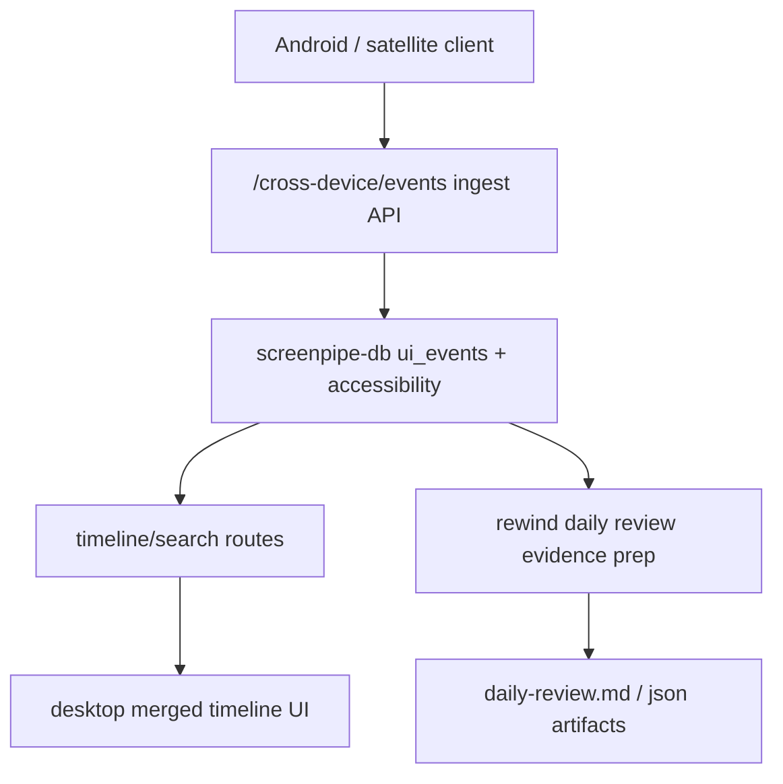

# Android Oracle Cross-Device Implementation Plan

> **For Claude:** REQUIRED SUB-SKILL: Use superpowers:executing-plans to implement this plan task-by-task.

**Goal:** Add the first cross-device foundation for MRnObrainer so an Oracle Mac can ingest normalized events from Android and other devices, surface them in the existing desktop timeline, and feed the daily recap pipeline.

**Architecture:** Reuse the existing SQLite-backed `ui_events`, `accessibility`, sync, and timeline stack instead of inventing a parallel mobile-only backend. Add a normalized cross-device ingest layer on the server, extend storage records with source-device metadata, and have the desktop UI and recap pipeline consume the merged stream.

**Tech Stack:** Rust, Axum, SQLx/SQLite, Next.js/Tauri desktop UI, Bun/TypeScript scripts, existing `rewind-daily-review` pipe.

## Architecture Diagram



## Existing Tools / Libraries Per Block

| Block | Existing Tool Found | Link | Recommendation |
|-------|---------------------|------|----------------|
| Passive activity capture reference | ActivityWatch | https://activitywatch.net/ | Adapt ideas only; do not adopt as the primary runtime. |
| Local-first artifact sync reference | Syncthing | https://syncthing.net/ | Keep as a later optional artifact transport, not the core event store. |
| JS local-first sync reference | RxDB | https://rxdb.info/ | Reference only; build custom on current Rust server. |
| Hosted reactive sync reference | Electric | https://electric-sql.com/ | Do not adopt for v1 Oracle-Mac architecture. |
| Android raw capture constraints | Android MediaProjection docs | https://developer.android.com/media/grow/media-projection | Use only for explicit opt-in capture sessions later. |
| Android app usage events | UsageStatsManager docs | https://developer.android.com/reference/android/app/usage/UsageStatsManager | Use for Android runtime planning later. |

---

### Task 1: Lock The Branch Artifacts

**Files:**
- Create: `docs/plans/2026-03-11-android-oracle-cross-device-design.md`
- Create: `docs/plans/2026-03-11-android-oracle-cross-device-implementation.md`

**Step 1: Confirm clean worktree**

Run: `git -C /Users/owenwong/Desktop/screenpipe-android-oracle status --short --branch`
Expected: only planned documentation or feature changes in `codex/android-oracle-v1`

**Step 2: Commit the design and plan docs**

Run:

```bash
git -C /Users/owenwong/Desktop/screenpipe-android-oracle add docs/plans/2026-03-11-android-oracle-cross-device-design.md docs/plans/2026-03-11-android-oracle-cross-device-implementation.md
git -C /Users/owenwong/Desktop/screenpipe-android-oracle commit -m "docs: add android oracle cross-device design"
```

Expected: one docs-only commit on `codex/android-oracle-v1`

### Task 2: Add Failing Tests For Cross-Device Event Ingest

**Files:**
- Create: `crates/screenpipe-server/tests/cross_device_events_test.rs`
- Modify: `crates/screenpipe-server/src/server.rs`

**Step 1: Write the failing test**

Add an integration test that:

- boots an in-memory `SCServer`
- posts a JSON batch to `POST /cross-device/events`
- asserts `200 OK`
- asserts one normalized UI event is persisted with the satellite device id/name/platform
- asserts one accessibility snapshot is persisted when sent in the same batch

Add a second test that:

- submits an unsupported event kind
- expects `400 BAD_REQUEST`

**Step 2: Run the test to verify it fails**

Run:

```bash
cargo test -p screenpipe-server cross_device_events -- --nocapture
```

Expected: failure because route and request types do not exist yet

**Step 3: Commit**

```bash
git -C /Users/owenwong/Desktop/screenpipe-android-oracle add crates/screenpipe-server/tests/cross_device_events_test.rs
git -C /Users/owenwong/Desktop/screenpipe-android-oracle commit -m "test: add failing cross-device ingest tests"
```

### Task 3: Implement The Server Ingest Contract

**Files:**
- Create: `crates/screenpipe-server/src/routes/cross_device.rs`
- Modify: `crates/screenpipe-server/src/routes/mod.rs`
- Modify: `crates/screenpipe-server/src/server.rs`

**Step 1: Define request/response types**

Add:

- `CrossDeviceEventBatchRequest`
- `CrossDeviceEventEnvelope`
- `CrossDeviceEventKind`
- `CrossDeviceIngestResponse`

Keep the contract JSON-friendly and platform-neutral:

- source device id/name/platform
- occurred_at
- session_id
- app_name/window_title/url
- text payload
- optional metadata object

**Step 2: Implement minimal route behavior**

`POST /cross-device/events` should:

- validate the batch is non-empty
- normalize supported kinds into existing DB insert helpers
- write interaction-like events to `ui_events`
- write snapshot-like text payloads to `accessibility`
- return inserted counts by category

Supported v1 kinds:

- `app_focus_changed`
- `window_focus_changed`
- `clipboard_changed`
- `text_shared`
- `notification_received`
- `user_note_created`
- `accessibility_snapshot`

**Step 3: Re-run the test**

Run:

```bash
cargo test -p screenpipe-server cross_device_events -- --nocapture
```

Expected: route exists, but DB persistence tests may still fail until Task 4 is complete

**Step 4: Commit**

```bash
git -C /Users/owenwong/Desktop/screenpipe-android-oracle add crates/screenpipe-server/src/routes/cross_device.rs crates/screenpipe-server/src/routes/mod.rs crates/screenpipe-server/src/server.rs
git -C /Users/owenwong/Desktop/screenpipe-android-oracle commit -m "feat: add cross-device ingest route"
```

### Task 4: Extend DB Inserts With Source Device Metadata

**Files:**
- Modify: `crates/screenpipe-db/src/types.rs`
- Modify: `crates/screenpipe-db/src/db.rs`
- Modify: `crates/screenpipe-db/tests/db.rs`

**Step 1: Write the failing DB test**

Add a DB-level test that inserts:

- one UI event with `machine_id` and `sync_id`
- one accessibility snapshot with `machine_id` and `sync_id`

Assert the stored records preserve:

- `machine_id`
- `sync_id`
- `device-identifying app context`

**Step 2: Run the DB test to verify it fails**

Run:

```bash
cargo test -p screenpipe-db machine_id -- --nocapture
```

Expected: failure because the insert helpers do not bind those fields yet

**Step 3: Implement minimal schema-aware changes**

Extend:

- `InsertUiEvent`
- `UiEventRecord`
- `UiEventRow`
- `insert_ui_event`
- `insert_ui_events_batch`
- `insert_accessibility_text`

Bind existing table columns:

- `machine_id`
- `sync_id`

Do not add a new migration in this first slice because the columns already exist on `ui_events` and `accessibility`.

**Step 4: Re-run both DB and server tests**

Run:

```bash
cargo test -p screenpipe-db machine_id -- --nocapture
cargo test -p screenpipe-server cross_device_events -- --nocapture
```

Expected: passing targeted tests

**Step 5: Commit**

```bash
git -C /Users/owenwong/Desktop/screenpipe-android-oracle add crates/screenpipe-db/src/types.rs crates/screenpipe-db/src/db.rs crates/screenpipe-db/tests/db.rs crates/screenpipe-server/tests/cross_device_events_test.rs
git -C /Users/owenwong/Desktop/screenpipe-android-oracle commit -m "feat: persist cross-device source metadata"
```

### Task 5: Expose Cross-Device Events To The Desktop Timeline

**Files:**
- Modify: `apps/mrnobrainer-app/components/rewind/dashboard-timeline-page.tsx`
- Modify: `apps/mrnobrainer-app/components/rewind/timeline/timeline.tsx`
- Modify: `apps/mrnobrainer-app/components/rewind/__tests__/dashboard-timeline-page.test.tsx`

**Step 1: Write the failing UI test**

Add a UI test that renders a merged timeline payload containing:

- local desktop events
- one Android-origin event with a distinct device label

Assert:

- device identity is visible
- non-desktop event kinds render without crashing
- ordering stays chronological

**Step 2: Run the UI test to verify it fails**

Run:

```bash
cd /Users/owenwong/Desktop/screenpipe-android-oracle/apps/mrnobrainer-app
bunx vitest run components/rewind/__tests__/dashboard-timeline-page.test.tsx
```

Expected: failure because cross-device event rendering is not supported yet

**Step 3: Implement minimal rendering**

Update the timeline view to:

- surface device badges on relevant items
- render text-based cross-device events as timeline rows
- keep the existing desktop frame/audio UI unchanged

Do not redesign the whole timeline yet.

**Step 4: Re-run the UI test**

Run:

```bash
cd /Users/owenwong/Desktop/screenpipe-android-oracle/apps/mrnobrainer-app
bunx vitest run components/rewind/__tests__/dashboard-timeline-page.test.tsx
```

Expected: targeted test passes

**Step 5: Commit**

```bash
git -C /Users/owenwong/Desktop/screenpipe-android-oracle add apps/mrnobrainer-app/components/rewind/dashboard-timeline-page.tsx apps/mrnobrainer-app/components/rewind/timeline/timeline.tsx apps/mrnobrainer-app/components/rewind/__tests__/dashboard-timeline-page.test.tsx
git -C /Users/owenwong/Desktop/screenpipe-android-oracle commit -m "feat: show cross-device events in timeline"
```

### Task 6: Feed The Daily Recap Pipeline

**Files:**
- Modify: `packages/sync/src/index.ts`
- Modify: `pipes/rewind-daily-review/scripts/prepare-evidence.mjs`
- Modify: `pipes/rewind-daily-review/README.md`

**Step 1: Write the failing recap test**

If no targeted recap test exists, create a focused script-level test that supplies mixed-device event data and expects:

- source devices listed
- mobile-origin actions present in evidence
- no duplicate timeline rows for the same event id

**Step 2: Run the test to verify it fails**

Run the narrowest available test command for the chosen test file.

Expected: failure because evidence prep only reflects current desktop-oriented search/query behavior

**Step 3: Implement minimal recap support**

Update evidence prep and summary generation so the recap pipeline:

- reads cross-device events
- preserves `sourceDevices`
- includes phone-to-desktop handoff markers in markdown and JSON

**Step 4: Re-run the recap test**

Expected: targeted test passes

**Step 5: Commit**

```bash
git -C /Users/owenwong/Desktop/screenpipe-android-oracle add packages/sync/src/index.ts pipes/rewind-daily-review/scripts/prepare-evidence.mjs pipes/rewind-daily-review/README.md
git -C /Users/owenwong/Desktop/screenpipe-android-oracle commit -m "feat: include cross-device events in recap pipeline"
```

### Task 7: Validate The Foundation End-To-End

**Files:**
- Modify only if fixes are required

**Step 1: Run targeted tests**

```bash
cargo test -p screenpipe-db machine_id -- --nocapture
cargo test -p screenpipe-server cross_device_events -- --nocapture
cd /Users/owenwong/Desktop/screenpipe-android-oracle/apps/mrnobrainer-app && bunx vitest run components/rewind/__tests__/dashboard-timeline-page.test.tsx
```

Expected: all targeted tests pass

**Step 2: Run one broader confidence check**

```bash
cargo test -p screenpipe-server endpoint_test -- --nocapture
```

Expected: no regression in existing server routing behavior from the new ingest route

**Step 3: Commit the final foundation slice**

```bash
git -C /Users/owenwong/Desktop/screenpipe-android-oracle status --short
git -C /Users/owenwong/Desktop/screenpipe-android-oracle commit -am "feat: add cross-device foundation for oracle mac"
```

## Test Plan

- Ingest valid mixed-device batches and verify UI event plus accessibility persistence.
- Reject unsupported event kinds with `400`.
- Preserve `machine_id` and `sync_id` on stored records.
- Render Android-origin rows in the desktop timeline without breaking existing frame/audio rendering.
- Include cross-device handoff evidence in recap artifacts.

## Assumptions And Defaults

- The first shipping source of truth is the Oracle Mac, not a hosted cloud backend.
- The first implementation slice reuses `ui_events` and `accessibility` instead of creating a new event table.
- Android raw capture is deferred; v1 foundation focuses on normalized event ingest plus merged timeline and recap support.
- Work stays in the same monorepo on branch `codex/android-oracle-v1` and worktree `/Users/owenwong/Desktop/screenpipe-android-oracle`.

Plan complete and saved to `docs/plans/2026-03-11-android-oracle-cross-device-implementation.md`. Two execution options:

1. Subagent-Driven (this session) - I dispatch fresh subagent per task, review between tasks, fast iteration
2. Parallel Session (separate) - Open new session with executing-plans, batch execution with checkpoints
