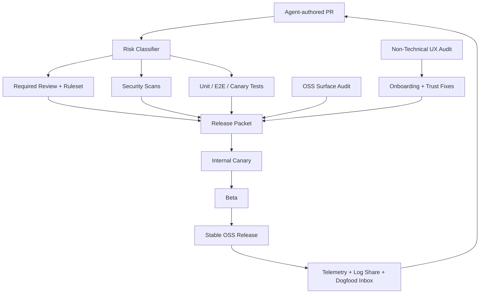

# Product Excellence Hardening Design

**Date:** 2026-03-11

**Goal:** Make MRnObrainer safe to ship with full-agent coding, credible as an open-source desktop product, and progressively usable by non-technical users.

## Current State

The repository already has strong raw material:

- a public-facing install path and friend-test checklist in [README.md](../../README.md)
- an open-source hygiene checklist in [../OSS_RELEASE_CHECKLIST.md](../OSS_RELEASE_CHECKLIST.md)
- a detailed regression checklist in [../../TESTING.md](../../TESTING.md)
- existing capture-health and permission-recovery UX in the desktop app
- an initial remote-agent direction in [remote-agent-service.md](./remote-agent-service.md)

The main gaps are operational rather than conceptual:

- critical CI paths still soft-pass
- JS/TS coverage is under-enforced compared to Rust coverage
- full-agent coding lacks a formal safety and merge model
- non-technical-user success still depends too much on permission literacy
- unattended dogfooding and release promotion are not yet first-class systems

## Design Principles

1. Fail closed on risky changes.
2. Prefer GitHub-native or established OSS tooling over custom infrastructure.
3. Treat desktop reliability as product quality, not just engineering quality.
4. Optimize first-run clarity for non-technical users.
5. Make trust inspectable: what is captured, what leaves device, what is healthy, and what failed.

## Recommended Architecture

## Workstreams

### 1. Full-Agent Coding Safety Model

Add an explicit policy for what agent-authored changes may do, what always requires human review, and what is forbidden.

Scope:

- protected-branch policy
- destructive-command policy
- secret and credential handling
- external network/API usage rules
- artifact and screenshot sanitation expectations

### 2. Hard Review and Merge Gates

Turn repo knowledge into enforced checks instead of human memory.

Scope:

- GitHub rulesets
- CODEOWNERS and PR template
- path-based risk classification
- required evidence for desktop-risk areas from [../../TESTING.md](../../TESTING.md)
- blocking status checks for critical flows

### 3. Security and Supply-Chain Hardening

Layer scanning and dependency review on top of the merge flow.

Scope:

- CodeQL for code scanning
- Semgrep for policy/security linting
- Gitleaks for secret detection
- GitHub dependency review
- OpenSSF Scorecard and step-security harden-runner where useful

### 4. OSS Release Hardening

Convert the existing open-source checklist into automation and evidence.

Scope:

- public-surface validation for docs, screenshots, fixtures, logs, and URLs
- branding consistency
- OSS-safe telemetry defaults
- release packet generation

### 5. Non-Technical User Readiness

Reduce the number of places where normal users need to reason like developers.

Scope:

- install from release artifact only
- permission prompts and recovery
- capture-health visibility
- first-success path: first frame, first search, first automation
- support export / log share

### 6. Unattended Validation and Dogfooding

Make the repo keep producing evidence while the team is away from the keyboard.

Scope:

- scheduled canary runs on real macOS and Windows hosts
- overnight and 8-12 hour stability checks
- release packet artifacts
- automatic issue filing from canary failures

### 7. Away-From-Computer Operation

Separate unattended improvement from unattended end-user runtime.

Scope:

- scheduled CI and self-hosted runners for unattended improvement
- always-on host strategy for actual unattended product runtime
- remote-agent health and context sync

## Existing Tools Chosen

| Problem | Tool | Why |
| --- | --- | --- |
| Risk-based CI routing | [dorny/paths-filter](https://github.com/dorny/paths-filter) | Mature, simple file-path classification |
| Merge enforcement | [GitHub rulesets](https://docs.github.com/en/repositories/configuring-branches-and-merges-in-your-repository/managing-rulesets/about-rulesets) | Native required-check and branch protections |
| Code scanning | [GitHub CodeQL](https://docs.github.com/en/code-security/code-scanning/creating-an-advanced-setup-for-code-scanning) | Native scanning and SARIF integration |
| Security linting | [Semgrep CI](https://semgrep.dev/docs/semgrep-ci/sample-ci-configs) | Fast policy and security checks |
| Secret scanning | [Gitleaks](https://github.com/gitleaks/gitleaks) | Well-known fail-closed secret scanner |
| UI test automation | [Playwright CI](https://playwright.dev/docs/ci) | Strong traces, screenshots, and CI ergonomics |

## Open-Source Readiness Assessment

### Ready enough for controlled OSS alpha

- local-first position is clear
- release artifact story exists
- public docs are directionally honest
- capture-health and permission recovery already exist in code

### Not ready enough for broad non-technical OSS adoption

- critical E2E still has soft-fail behavior
- JS/TS test coverage is not enforced at the same level as Rust
- permission and relaunch recovery are present but still technical in tone
- the product still assumes users will understand localhost-backed status and developer-style failure modes
- there is not yet a formal release-ring model with evidence thresholds

## UX / Non-Technical User Findings

1. The product already exposes health, but it does not yet fully translate health into plain-language confidence.
2. Permission recovery is implemented, but users still need clearer "what happened / what next" guidance.
3. Non-technical users need a visible first-value ladder:
   - capture is on
   - recent activity is visible
   - search works
   - automation suggestion is understandable
4. Supportability is improving because log sharing exists, but the release process still needs a friend-test gate before wider OSS pushes.

## Release Criteria

Ship to broader OSS users only after all of the following are true:

- critical E2E and JS/TS tests fail closed
- path-based risk checks are wired into protected-branch rules
- OSS checklist is partly automated and part of release evidence
- canary runs exist on physical macOS and Windows hosts
- a non-technical tester can install, grant permissions, confirm capture, and recover from common failure paths without terminal help

## Risks

- over-hardening merge gates can slow iteration if scopes and owners are unclear
- too much telemetry can violate trust if it is not minimal and inspectable
- self-hosted canary runners add operational cost and maintenance
- agent-authored changes will remain risky until policy and protected-branch enforcement are both live

## Recommended Sequence

1. safety model and hard merge gates
2. security and OSS release hardening
3. non-technical onboarding and trust fixes
4. unattended canary and release packet automation
5. away-from-computer operation on always-on hosts
