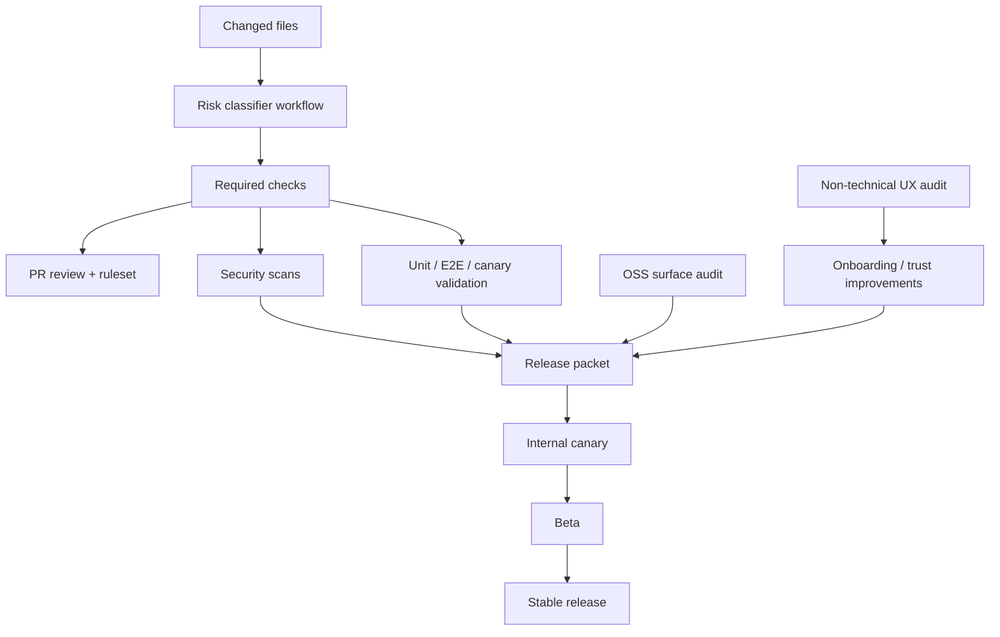

# Product Excellence Hardening Implementation Plan

> **For Claude:** REQUIRED SUB-SKILL: Use superpowers:executing-plans to implement this plan task-by-task.

**Goal:** Harden MRnObrainer for full-agent coding, open-source distribution, and non-technical-user readiness without relying on soft-fail CI or ad hoc release judgment.

**Architecture:** Add a fail-closed quality system around the existing product. Path-based risk classification drives required reviews, security scans, and platform validation; release candidates generate evidence packets; non-technical onboarding and trust surfaces become explicit product requirements rather than "nice to have" polish.

**Tech Stack:** GitHub Actions, GitHub rulesets, dorny/paths-filter, CodeQL, Semgrep, Gitleaks, Playwright/WebdriverIO, Bun/Vitest, Rust cargo tests, Tauri desktop app, self-hosted macOS/Windows runners.

## Architecture Diagram



## Existing Tools / Libraries Per Block

| Block | Existing Tool Found | Link | Recommendation |
|-------|-------------------|------|----------------|
| Risk classification | dorny/paths-filter | https://github.com/dorny/paths-filter | Use as-is |
| Branch enforcement | GitHub rulesets | https://docs.github.com/en/repositories/configuring-branches-and-merges-in-your-repository/managing-rulesets/about-rulesets | Use as-is |
| Code scanning | GitHub CodeQL | https://docs.github.com/en/code-security/code-scanning/creating-an-advanced-setup-for-code-scanning | Use as-is |
| Policy/security linting | Semgrep CI | https://semgrep.dev/docs/semgrep-ci/sample-ci-configs | Use as-is |
| Secret scanning | Gitleaks | https://github.com/gitleaks/gitleaks | Use as-is |
| UI/browser CI evidence | Playwright CI guidance | https://playwright.dev/docs/ci | Adapt to repo |
| Supply-chain posture | Dependency Review / Scorecard | https://docs.github.com/en/code-security/supply-chain-security/understanding-your-software-supply-chain/about-dependency-review, https://github.com/ossf/scorecard-action | Use as-is |

---

### Task 1: Establish Full-Agent Coding Safety Policy

**Files:**
- Create: `.github/pull_request_template.md`
- Create: `docs/agent-coding-safety-policy.md`
- Create: `.github/CODEOWNERS`
- Modify: `AGENTS.md`

**Step 1: Write the failing policy checklist**

Create `docs/agent-coding-safety-policy.md` with empty unchecked sections for:

```md
- [ ] protected branch policy
- [ ] destructive command policy
- [ ] secret handling
- [ ] network/API usage
- [ ] artifact sanitization
- [ ] required human review
```

**Step 2: Run a repository sanity check**

Run:

```bash
cd /Users/owenwong/Desktop/screenpipe/screenpipe
rg -n "reset --hard|checkout --|continue-on-error|secret|SENTRY|POSTHOG" AGENTS.md .github docs apps/mrnobrainer-app
```

Expected: existing policy surface is discoverable and can be cross-referenced in the new doc.

**Step 3: Write the minimal policy implementation**

Add concrete rules covering:

```md
- agents never merge directly to protected branches
- agents cannot bypass failing checks
- agents cannot commit secrets, screenshots with private data, or raw logs without review
- destructive git commands require explicit user request
- networked changes require review when they add new outbound data paths
```

Add matching review prompts to `.github/pull_request_template.md` and ownership paths to `.github/CODEOWNERS`.

**Step 4: Verify policy coverage**

Run:

```bash
cd /Users/owenwong/Desktop/screenpipe/screenpipe
rg -n "agent|protected branch|destructive|secret|review" docs/agent-coding-safety-policy.md .github/pull_request_template.md .github/CODEOWNERS AGENTS.md
```

Expected: each policy topic appears in at least one enforced or documented surface.

**Step 5: Commit**

```bash
git add .github/pull_request_template.md .github/CODEOWNERS AGENTS.md docs/agent-coding-safety-policy.md
git commit -m "docs: define full-agent coding safety policy"
```

### Task 2: Add Path-Based Risk Classification and Required Evidence

**Files:**
- Create: `.github/workflows/risk-classifier.yml`
- Create: `.github/scripts/check-risk-evidence.sh`
- Modify: `.github/workflows/ci.yml`
- Modify: `.github/workflows/e2e-test.yml`
- Modify: `TESTING.md`

**Step 1: Write the failing risk map**

Create a first-pass classifier config in `.github/workflows/risk-classifier.yml` using path groups like:

```yaml
windowing:
  - "apps/mrnobrainer-app/src-tauri/**"
  - "apps/mrnobrainer-app/components/**"
audio:
  - "crates/screenpipe-audio/**"
  - "crates/screenpipe-core/**"
oss_surface:
  - "README.md"
  - "docs/**"
  - "apps/mrnobrainer-app/lib/oss-public.ts"
```

**Step 2: Run the classifier shell locally**

Run:

```bash
cd /Users/owenwong/Desktop/screenpipe/screenpipe
bash .github/scripts/check-risk-evidence.sh
```

Expected: FAIL because the script and required evidence wiring are not implemented yet.

**Step 3: Implement minimal risk evidence enforcement**

Add:

- `dorny/paths-filter` in the workflow
- a shell script that checks for required labels/artifacts/acknowledgements
- links from high-risk groups back into sections of `TESTING.md`

**Step 4: Verify the workflow parses**

Run:

```bash
cd /Users/owenwong/Desktop/screenpipe/screenpipe
yamllint .github/workflows/risk-classifier.yml || true
bash -n .github/scripts/check-risk-evidence.sh
```

Expected: shell syntax passes; if `yamllint` is unavailable, manual YAML review is still possible.

**Step 5: Commit**

```bash
git add .github/workflows/risk-classifier.yml .github/scripts/check-risk-evidence.sh .github/workflows/ci.yml .github/workflows/e2e-test.yml TESTING.md
git commit -m "ci: add path-based risk classification"
```

### Task 3: Remove Soft-Fail Critical Validation

**Files:**
- Modify: `.github/workflows/e2e-test.yml`
- Modify: `.github/workflows/e2e-macos.yml`
- Modify: `.github/workflows/ci.yml`
- Modify: `apps/mrnobrainer-app/package.json`

**Step 1: Write the failing check**

Run:

```bash
cd /Users/owenwong/Desktop/screenpipe/screenpipe
rg -n "continue-on-error: true|# - name: Run bun tests|#   run: bun test" .github/workflows apps/mrnobrainer-app/package.json
```

Expected: matches found in critical workflows.

**Step 2: Make the smallest safe enforcement change**

Implement:

- remove `continue-on-error` from user-critical E2E steps
- restore Bun/Vitest coverage in `.github/workflows/ci.yml`
- ensure the app package exposes any missing test command needed by CI

**Step 3: Verify changed workflow commands locally**

Run:

```bash
cd /Users/owenwong/Desktop/screenpipe/screenpipe/apps/mrnobrainer-app
bun test
```

Run:

```bash
cd /Users/owenwong/Desktop/screenpipe/screenpipe
rg -n "continue-on-error: true" .github/workflows/e2e-test.yml .github/workflows/e2e-macos.yml
```

Expected: only intentionally non-blocking artifact or debugging steps remain soft-failing.

**Step 4: Verify no accidental command regressions**

Run:

```bash
cd /Users/owenwong/Desktop/screenpipe/screenpipe
sed -n '1,220p' .github/workflows/ci.yml
sed -n '150,240p' .github/workflows/e2e-test.yml
```

Expected: Bun/Vitest and critical E2E are visibly wired into blocking jobs.

**Step 5: Commit**

```bash
git add .github/workflows/e2e-test.yml .github/workflows/e2e-macos.yml .github/workflows/ci.yml apps/mrnobrainer-app/package.json
git commit -m "ci: fail closed on critical validation"
```

### Task 4: Add Security and Supply-Chain Scanning

**Files:**
- Create: `.github/workflows/codeql.yml`
- Create: `.github/workflows/semgrep.yml`
- Create: `.github/workflows/gitleaks.yml`
- Create: `.github/workflows/dependency-review.yml`
- Create: `.github/workflows/scorecard.yml`
- Modify: `.github/workflows/ci.yml`

**Step 1: Write the failing workflow inventory**

Run:

```bash
cd /Users/owenwong/Desktop/screenpipe/screenpipe
rg -n "CodeQL|semgrep|gitleaks|dependency-review|scorecard|harden-runner" .github/workflows
```

Expected: either no matches or incomplete coverage.

**Step 2: Add the smallest complete workflow set**

Use GitHub-native or maintained OSS actions to add:

```yaml
- CodeQL for Rust and JavaScript/TypeScript
- dependency-review-action on pull requests
- semgrep ci
- gitleaks scan
- scorecard action on default branch
```

Add `step-security/harden-runner` only where it improves egress visibility without breaking builds.

**Step 3: Verify workflow syntax**

Run:

```bash
cd /Users/owenwong/Desktop/screenpipe/screenpipe
for f in .github/workflows/codeql.yml .github/workflows/semgrep.yml .github/workflows/gitleaks.yml .github/workflows/dependency-review.yml .github/workflows/scorecard.yml; do
  sed -n '1,220p' "$f"
done
```

Expected: each workflow targets the correct events and repo languages.

**Step 4: Verify documentation alignment**

Update the CI or contributing docs to mention the new checks, then run:

```bash
cd /Users/owenwong/Desktop/screenpipe/screenpipe
rg -n "CodeQL|Semgrep|Gitleaks|dependency review|Scorecard" README.md CONTRIBUTING.md docs .github/workflows
```

Expected: contributors can discover why these checks exist.

**Step 5: Commit**

```bash
git add .github/workflows/codeql.yml .github/workflows/semgrep.yml .github/workflows/gitleaks.yml .github/workflows/dependency-review.yml .github/workflows/scorecard.yml .github/workflows/ci.yml README.md CONTRIBUTING.md docs
git commit -m "security: add code and supply-chain scanning"
```

### Task 5: Operationalize OSS Release Hardening

**Files:**
- Create: `.github/workflows/oss-surface-audit.yml`
- Create: `.github/scripts/check_oss_surface.sh`
- Modify: `docs/OSS_RELEASE_CHECKLIST.md`
- Modify: `README.md`
- Modify: `apps/mrnobrainer-app/lib/oss-public.ts`
- Modify: `apps/mrnobrainer-app/lib/__tests__/oss-public.test.ts`

**Step 1: Write the failing OSS surface check**

Run:

```bash
cd /Users/owenwong/Desktop/screenpipe/screenpipe
python3 .github/scripts/validate_open_source_surface.py
```

Expected: establishes current baseline behavior and any failures.

**Step 2: Implement automated OSS surface auditing**

Add a workflow and shell wrapper that run:

```bash
pre-commit run --all-files
python3 .github/scripts/validate_open_source_surface.py
git ls-files -z | python3 .github/scripts/filter_detect_secrets_paths.py | xargs -0 detect-secrets-hook --baseline .secrets.baseline
```

Also tighten `oss-public.ts` and its tests where needed so OSS-safe telemetry defaults are explicit.

**Step 3: Verify OSS-safe behavior**

Run:

```bash
cd /Users/owenwong/Desktop/screenpipe/screenpipe/apps/mrnobrainer-app
bunx vitest run lib/__tests__/oss-public.test.ts --config vitest.config.ts
```

Run:

```bash
cd /Users/owenwong/Desktop/screenpipe/screenpipe
bash .github/scripts/check_oss_surface.sh
```

Expected: docs and code agree on public-surface behavior.

**Step 4: Verify contributor-facing guidance**

Run:

```bash
cd /Users/owenwong/Desktop/screenpipe/screenpipe
rg -n "open-source|OSS|telemetry|PostHog|Sentry|example.com" README.md docs/OSS_RELEASE_CHECKLIST.md apps/mrnobrainer-app/lib/oss-public.ts
```

Expected: user-facing docs match the actual OSS posture.

**Step 5: Commit**

```bash
git add .github/workflows/oss-surface-audit.yml .github/scripts/check_oss_surface.sh docs/OSS_RELEASE_CHECKLIST.md README.md apps/mrnobrainer-app/lib/oss-public.ts apps/mrnobrainer-app/lib/__tests__/oss-public.test.ts
git commit -m "oss: automate public-surface auditing"
```

### Task 6: Audit and Improve Non-Technical First-Run UX

**Files:**
- Create: `docs/non-technical-user-audit.md`
- Modify: `apps/mrnobrainer-app/components/status/permission-banner.tsx`
- Modify: `apps/mrnobrainer-app/components/status/permission-buttons.tsx`
- Modify: `apps/mrnobrainer-app/components/status/capture-health-card.tsx`
- Modify: `apps/mrnobrainer-app/components/onboarding/read-content.tsx`
- Modify: `apps/mrnobrainer-app/app/page.tsx`
- Modify: `apps/mrnobrainer-app/components/share-logs-button.tsx`

**Step 1: Write the failing audit rubric**

Create `docs/non-technical-user-audit.md` with rubric headings:

```md
- install from DMG only
- permission comprehension
- relaunch comprehension
- first frame visible
- first search success
- first automation comprehension
- recovery without terminal
- support export clarity
```

**Step 2: Run the audit as a checklist**

Use the app or code walkthrough to record at least one finding for each failed rubric item. If live app execution is unavailable, document that limitation explicitly.

Expected: a prioritized finding list exists before editing UX copy or flows.

**Step 3: Make minimal trust-and-recovery improvements**

Target copy and state clarity first:

- plain-language permission banner text
- stronger "what to do next" wording
- clearer capture-health statuses
- more obvious support export wording

**Step 4: Verify with focused tests**

Run:

```bash
cd /Users/owenwong/Desktop/screenpipe/screenpipe/apps/mrnobrainer-app
bun test
```

Then review affected files:

```bash
sed -n '1,220p' components/status/permission-banner.tsx
sed -n '1,240p' components/status/permission-buttons.tsx
sed -n '1,240p' components/onboarding/read-content.tsx
```

Expected: copy is materially less technical and recovery states are easier to follow.

**Step 5: Commit**

```bash
git add docs/non-technical-user-audit.md apps/mrnobrainer-app/components/status/permission-banner.tsx apps/mrnobrainer-app/components/status/permission-buttons.tsx apps/mrnobrainer-app/components/status/capture-health-card.tsx apps/mrnobrainer-app/components/onboarding/read-content.tsx apps/mrnobrainer-app/app/page.tsx apps/mrnobrainer-app/components/share-logs-button.tsx
git commit -m "ux: improve non-technical onboarding and recovery"
```

### Task 7: Add Trust Surface and Release Packet Evidence

**Files:**
- Create: `.github/workflows/release-packet.yml`
- Create: `docs/release-packet-template.md`
- Modify: `apps/mrnobrainer-app/components/screenpipe-status.tsx`
- Modify: `apps/mrnobrainer-app/components/status/capture-health-card.tsx`
- Modify: `apps/mrnobrainer-app/components/feature-request-link.tsx`

**Step 1: Write the failing release packet template**

Create `docs/release-packet-template.md` with sections:

```md
- CI status
- canary results
- benchmark deltas
- onboarding findings
- OSS checklist status
- open P0/P1 issues
- rollback readiness
```

**Step 2: Add a workflow that assembles evidence artifacts**

The workflow should collect:

- test logs
- screenshots / traces from E2E
- benchmark summaries
- OSS audit outputs

**Step 3: Add minimal user-visible trust UI**

Expose or improve:

- capture health
- automation health or current failure reason where available
- clearer links for bug report / feedback / logs

**Step 4: Verify artifact generation and UI references**

Run:

```bash
cd /Users/owenwong/Desktop/screenpipe/screenpipe
sed -n '1,220p' .github/workflows/release-packet.yml
```

Run:

```bash
cd /Users/owenwong/Desktop/screenpipe/screenpipe/apps/mrnobrainer-app
bun test
```

Expected: release evidence is reproducible and trust surfaces are easier to discover.

**Step 5: Commit**

```bash
git add .github/workflows/release-packet.yml docs/release-packet-template.md apps/mrnobrainer-app/components/screenpipe-status.tsx apps/mrnobrainer-app/components/status/capture-health-card.tsx apps/mrnobrainer-app/components/feature-request-link.tsx
git commit -m "release: add evidence packet and trust surfaces"
```

### Task 8: Add Scheduled Canary and Longevity Loops

**Files:**
- Create: `.github/workflows/nightly-canary-macos.yml`
- Create: `.github/workflows/nightly-canary-windows.yml`
- Create: `.github/scripts/file_canary_issue.sh`
- Modify: `.github/workflows/windows-longevity-test.yml`
- Modify: `.github/workflows/e2e-macos.yml`
- Modify: `docs/plans/remote-agent-service.md`

**Step 1: Write the failing canary requirements**

Document required nightly coverage directly in each workflow header:

```yaml
# required coverage:
# - permissions
# - overlay/fullscreen
# - tray/dock
# - sleep/wake or restart
# - updater flow
# - clean quit
# - long-run health
```

**Step 2: Add scheduled workflows for self-hosted devices**

Use scheduled triggers and self-hosted runner labels for physical macOS and Windows machines.

**Step 3: Add automatic issue filing on failures**

Implement a shell script that opens or updates GitHub issues with:

- failing workflow
- platform
- logs / artifacts
- reproduction hints

**Step 4: Verify schedule and script behavior**

Run:

```bash
cd /Users/owenwong/Desktop/screenpipe/screenpipe
bash -n .github/scripts/file_canary_issue.sh
sed -n '1,220p' .github/workflows/nightly-canary-macos.yml
sed -n '1,220p' .github/workflows/nightly-canary-windows.yml
```

Expected: workflows are ready for self-hosted runner labels and issue filing syntax is valid.

**Step 5: Commit**

```bash
git add .github/workflows/nightly-canary-macos.yml .github/workflows/nightly-canary-windows.yml .github/scripts/file_canary_issue.sh .github/workflows/windows-longevity-test.yml .github/workflows/e2e-macos.yml docs/plans/remote-agent-service.md
git commit -m "ops: add nightly canary and longevity loops"
```

### Task 9: Define Release Rings and Promotion Criteria

**Files:**
- Create: `docs/release-rings.md`
- Modify: `README.md`
- Modify: `docs/OSS_RELEASE_CHECKLIST.md`
- Modify: `.github/workflows/release-app.yml`

**Step 1: Write the failing promotion matrix**

Create `docs/release-rings.md` with rows for:

```md
internal canary
beta
stable
```

Columns:

```md
required checks
required evidence
allowed audience
rollback requirement
```

**Step 2: Implement the minimal release-gate integration**

Update `release-app.yml` and release docs to reference the ring model and release packet artifact.

**Step 3: Verify the docs and workflow agree**

Run:

```bash
cd /Users/owenwong/Desktop/screenpipe/screenpipe
rg -n "internal canary|beta|stable|release packet|rollback" README.md docs/OSS_RELEASE_CHECKLIST.md docs/release-rings.md .github/workflows/release-app.yml
```

Expected: the same release vocabulary appears in docs and workflows.

**Step 4: Manual review**

Review:

```bash
sed -n '1,220p' docs/release-rings.md
sed -n '820,980p' .github/workflows/release-app.yml
```

Expected: promotion criteria are clear enough to use without tribal knowledge.

**Step 5: Commit**

```bash
git add docs/release-rings.md README.md docs/OSS_RELEASE_CHECKLIST.md .github/workflows/release-app.yml
git commit -m "docs: define release rings and promotion gates"
```

### Task 10: Separate Unattended Improvement from Away-From-Computer Runtime

**Files:**
- Modify: `docs/plans/remote-agent-service.md`
- Modify: `packages/agent/README.md`
- Create: `docs/away-from-computer-ops.md`

**Step 1: Write the failing model split**

Create `docs/away-from-computer-ops.md` with two top-level sections:

```md
1. unattended improvement
2. unattended product runtime
```

**Step 2: Document the always-on host model**

Clarify:

- CI and self-hosted runners improve the app while the team is away
- user-facing unattended value requires an always-on host, not a sleeping laptop
- remote-agent sync and health are part of the product, not a side note

**Step 3: Verify public docs do not over-promise**

Run:

```bash
cd /Users/owenwong/Desktop/screenpipe/screenpipe
rg -n "24/7|away|always-on|remote agent|laptop" README.md docs/plans/remote-agent-service.md packages/agent/README.md docs/away-from-computer-ops.md
```

Expected: docs are aligned and avoid implying that a sleeping laptop can still capture locally.

**Step 4: Manual review**

Review the three docs together and ensure user expectations are explicit.

**Step 5: Commit**

```bash
git add docs/plans/remote-agent-service.md packages/agent/README.md docs/away-from-computer-ops.md
git commit -m "docs: clarify away-from-computer operating model"
```

## Validation Checklist For The Whole Plan

Run this after each completed block and again before release work:

```bash
cd /Users/owenwong/Desktop/screenpipe/screenpipe
pre-commit run --all-files
cargo test
cd apps/mrnobrainer-app && bun test
```

For platform-specific changes, also run the relevant workflows or self-hosted canaries and attach evidence to the release packet.

## Execution Handoff

Plan complete and saved to `docs/plans/2026-03-11-product-excellence-hardening-plan.md`.

Two execution options:

**1. Subagent-Driven (this session)** - I dispatch fresh subagent per task, with reviewer/tester/optimizer loops between tasks

**2. Parallel Session (separate)** - Open a new session with executing-plans for batch implementation

Your standing preference is subagent-driven, so the default next step is Task 1 in this session.
